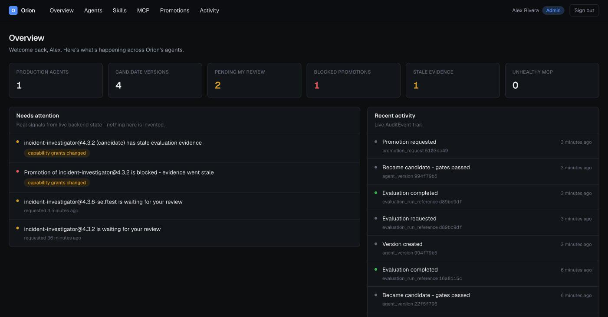
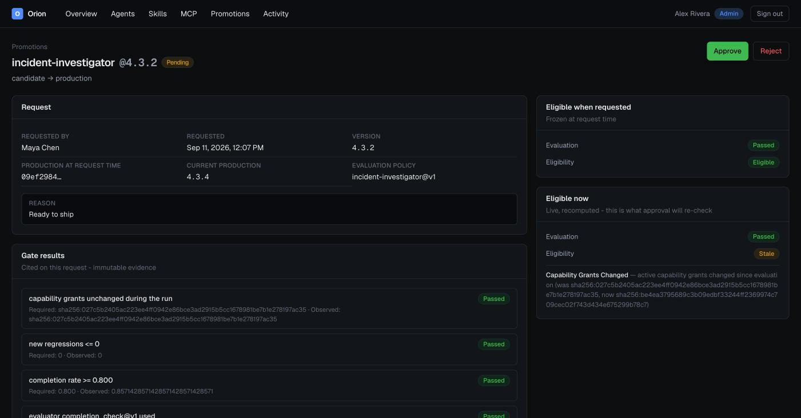
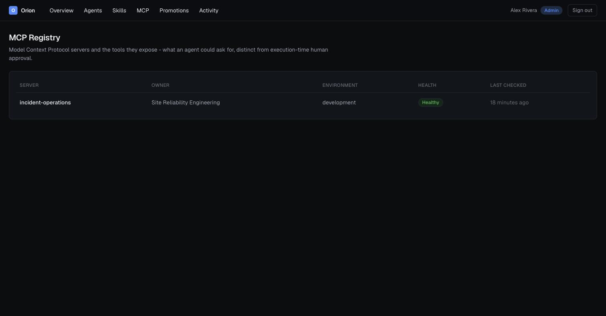
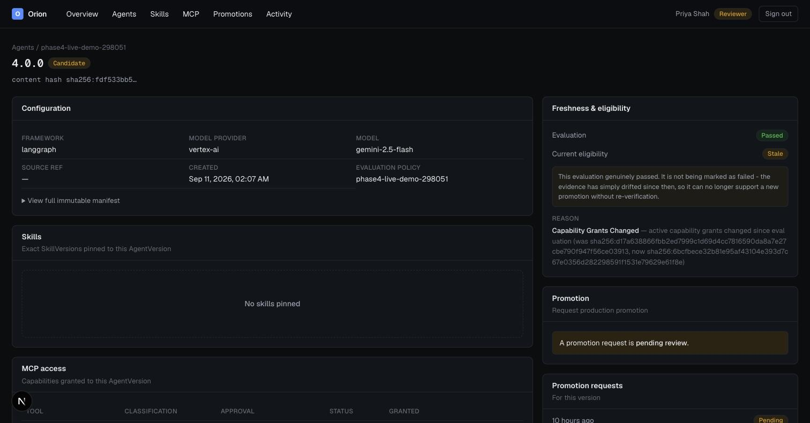

# Orion Agent Developer Platform

An internal control plane for Orion Commerce engineering teams to **register, version, evaluate, govern, and promote AI agents** and the capabilities they depend on (skills and MCP tools).

This is **not** an agent runtime. It does not execute agents, does not run evaluations, and does not execute MCP tools. It is the system of record for *what agent version is running, what it's built from, what evidence justified promoting it, who approved it, and why* - the same relationship a deployment/release-management system has to the services it tracks, not the relationship a compute platform has to the workloads it runs.

## Screenshots

**Overview** - live counts and a "Needs Attention" list:

**Promotion review**  - the freshness UX differentiator, on the actual review screen: "eligible when requested" (frozen) vs. "eligible now" (live, recomputed) shown side by side, with the before/after capability-grant hash that made it go stale - a historically-passing evaluation is never retroactively marked as failed:

**MCP registry** - an HTTP health check against the Incident Operations backend:

**AgentVersion detail**  - the same freshness distinction on the version reproducibility page:

## Running it

**Deployed**: the live instance runs on Cloud Run - see [`docs/gcp-architecture.md`](docs/gcp-architecture.md) for the topology and [`docs/phase-notes/phase-6.md`](docs/phase-notes/phase-6.md) for the deployment record. Service URLs are internal (Identity Platform-gated); ask a team member for access rather than assuming a public URL in these docs is meant for direct browsing.

**Locally**: Backend (FastAPI + Postgres): see `backend/README.md` for the real dev-login flow and environment variables. Frontend (Next.js): `cd frontend && npm install && npm run dev`, pointed at the backend via `BACKEND_API_URL` in `frontend/.env.local`. Sign in at `/login` as one of the four seeded Orion Commerce users - see [`docs/frontend-architecture.md`](docs/frontend-architecture.md) for how that auth flow is real, not mocked. `dev-login` is local-only by design - the deployed environment always uses real Identity Platform password sign-in (`docs/auth-and-approval-model.md`).

## Why this exists

Orion Commerce has multiple teams building AI agents on different frameworks, models, skill sets, and MCP tool integrations. Today there is no shared answer to basic governance questions: which version is in production, what exactly it's built from, what evaluation evidence supported promoting it, which tools it can call and which of those are write-capable, or who approved it. This platform exists to answer those questions consistently across teams, without becoming a second runtime, a second evaluation system, or a second MCP implementation.

## Real integrations, not simulated ones

This platform is designed against the **actual, inspected contracts** of three existing internal systems, not idealized versions of them:

- **[Incident Investigation Platform](../ai-operations)** (`ai-operations`) - a live LangGraph + Vertex AI Gemini multi-agent system on Cloud Run. Treated as the first real managed agent (`incident-investigator`).
- **Incident Operations MCP server** (`ai-operations/mcp_server`) - a FastMCP stdio server exposing 4 tools (3 read-only, 1 write/approval-gated) as a thin wrapper over the Incident Investigation Platform's API. Treated as the first governed MCP integration.
- **[Agent Evaluation Platform](../agent-eval)** (`agent-eval`) - an independent FastAPI/Postgres service with a real `Agent`/`AgentVersion`/`Evaluator` model. Treated as the external source of truth for evaluation execution; this platform never re-implements evaluators, datasets, or regression logic.

Where these systems have real gaps (no auth, a synchronous-only evaluation API, a non-server-enforced tool-approval gate), this platform's design accounts for the gap rather than pretending it doesn't exist. See [`docs/failure-modes.md`](docs/failure-modes.md).

## Documentation map

| Doc | Purpose |
|---|---|
| [`docs/product-overview.md`](docs/product-overview.md) | Product boundary, users, what questions the platform answers |
| [`docs/architecture.md`](docs/architecture.md) | System context, service boundaries, diagrams index |
| [`docs/domain-model.md`](docs/domain-model.md) | Entities, relationships, ERD |
| [`docs/control-plane-boundaries.md`](docs/control-plane-boundaries.md) | What this platform owns vs. the execution/evaluation/tool planes |
| [`docs/agent-versioning.md`](docs/agent-versioning.md) | Agent vs. AgentVersion, immutability rules |
| [`docs/agent-manifest.md`](docs/agent-manifest.md) | The reproducible version manifest format |
| [`docs/skills-and-capabilities.md`](docs/skills-and-capabilities.md) | Skill/SkillVersion model |
| [`docs/mcp-governance.md`](docs/mcp-governance.md) | MCP registry, capability grants, authorization vs. approval |
| [`docs/api-reference.md`](docs/api-reference.md) | Endpoint list, required roles, error conventions |
| [`docs/evaluation-and-promotion.md`](docs/evaluation-and-promotion.md) | Evaluation integration contract, gate model, promotion lifecycle |
| [`docs/auth-and-approval-model.md`](docs/auth-and-approval-model.md) | Roles, permission matrix, self-approval rule |
| [`docs/audit-model.md`](docs/audit-model.md) | Audit events, consistency guarantees |
| [`docs/frontend-architecture.md`](docs/frontend-architecture.md) | Next.js information architecture, auth integration, request flow, freshness UX |
| [`docs/gcp-architecture.md`](docs/gcp-architecture.md) | Cloud services and why each one exists |
| [`docs/failure-modes.md`](docs/failure-modes.md) | Designed behavior under partial failure |
| [`docs/repo-structure.md`](docs/repo-structure.md) | Planned repo layout |
| [`docs/roadmap.md`](docs/roadmap.md) | Implementation phases |
| [`docs/open-questions.md`](docs/open-questions.md) | Unresolved design questions |
| [`docs/adrs/`](docs/adrs/) | Architecture Decision Records |

## Sample organization: Orion Commerce

Seeded teams, users, and agents used throughout the docs and, later, the seed data - see [`docs/product-overview.md`](docs/product-overview.md#orion-commerce-sample-organization) for the full roster. Only the Incident Investigator is a real runtime integration; the Customer Support Agent and Release Risk Agent are representative platform data, clearly marked as such wherever they appear.
