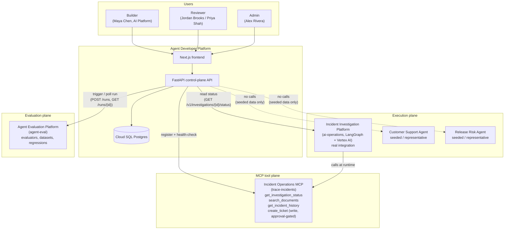

# Architecture

## System context

The platform sits beside three existing systems, never inside them. Only `ai-operations` and its MCP server and `agent-eval` are called over real network boundaries; `Customer Support Agent` and `Release Risk Agent` exist only as rows in this platform's own database, clearly labeled as seeded.

## Service boundaries

| Service | Repo | Responsibility | New in this project? |
|---|---|---|---|
| Agent Developer Platform frontend | this repo, `frontend/` | Developer-facing UI | Yes |
| Agent Developer Platform API | this repo, `backend/` | Control-plane logic: registries, grants, policy, promotion, audit | Yes |
| Agent Developer Platform DB | this repo, Cloud SQL | Control-plane data of record | Yes |
| Incident Investigation Platform | `ai-operations` | Agent execution (LangGraph) | No - existing, real |
| Incident Operations MCP server | `ai-operations/mcp_server` | Tool execution for the Incident Investigator | No - existing, real |
| Agent Evaluation Platform | `agent-eval` | Evaluator/dataset/regression execution | No - existing, real |

See [`control-plane-boundaries.md`](control-plane-boundaries.md) for the ownership rule that keeps these from blurring together, and [ADR-0001](adrs/0001-control-plane-execution-plane-separation.md) for the decision record.

## Diagram index

| # | Diagram | Location |
|---|---|---|
| 1 | System context | above |
| 2 | Control plane vs. execution plane | [`control-plane-boundaries.md`](control-plane-boundaries.md#diagram-plane-separation) |
| 3 | GCP deployment topology | [`gcp-architecture.md`](gcp-architecture.md#diagram-deployment-topology) |
| 4 | Core domain / ER relationships | [`domain-model.md`](domain-model.md#diagram-core-domain-relationships) |
| 5 | AgentVersion + SkillVersion + MCP capability relationship | [`skills-and-capabilities.md`](skills-and-capabilities.md#diagram-version-skill-capability-relationship) |
| 6 | Evaluation request/result sequence | [`evaluation-and-promotion.md`](evaluation-and-promotion.md#diagram-evaluation-sequence) |
| 7 | Promotion sequence | [`evaluation-and-promotion.md`](evaluation-and-promotion.md#diagram-promotion-sequence) |
| 8 | Promotion state machine | [`evaluation-and-promotion.md`](evaluation-and-promotion.md#diagram-promotion-state-machine) |
| 9 | MCP governance/approval flow | [`mcp-governance.md`](mcp-governance.md#diagram-governance-flow) |
| 10 | Audit/event flow | [`audit-model.md`](audit-model.md#diagram-audit-event-flow) |

## Why FastAPI + Next.js + Cloud Run

`ai-operations` and `agent-eval` both already use this exact stack (FastAPI backend, Next.js frontend), and this platform's own backend/frontend are now deployed the same way (Phase 6). Matching it isn't a style preference - it means Orion Commerce engineers moving between this platform and the systems it governs see one stack, and it means patterns already proven in `ai-operations` (Cloud Run + Cloud SQL, a Unix-socket connector rather than a VPC connector - see the Phase 6 correction in `gcp-architecture.md`) can be reused directly rather than re-derived. See [`gcp-architecture.md`](gcp-architecture.md).

Notably, **this platform makes no LLM calls of its own** - it has no model provider dependency, unlike all three systems it governs. It is pure CRUD, orchestration, and policy evaluation over data supplied by other systems. See [ADR-0013](adrs/0013-no-first-party-model-usage.md).
