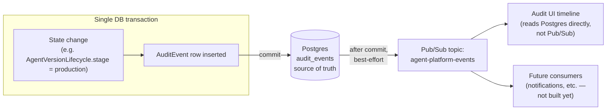

# Audit Model

## Goal

Given any production `AgentVersion`, reconstruct *why* it's there — what evidence justified it, who requested promotion, who approved it, and what was true at each step — without needing tribal knowledge or cross-referencing Slack. This is the platform's answer to a gap visible in all three inspected systems: none of them have an audit trail tying a decision to the evidence that justified it (`ai-operations`' `deployed_by`/`approved_by` are unauthenticated free-text strings with no linkage to *why*).

## Event catalog

| Event | Emitted when | Key payload fields |
|---|---|---|
| `agent.created` | New `Agent` | `agent_id, name, team_id, created_by` |
| `agent_version.created` | New `AgentVersion` | `agent_version_id, agent_id, version_label, content_hash, created_by` |
| `skill_version.published` | New `SkillVersion` | `skill_version_id, skill_id, version, owner_id` |
| `capability.granted` | `AgentCapabilityGrant` created | `grant_id, agent_version_id, mcp_tool_id, classification, granted_by` |
| `capability.revoked` | Grant revoked | `grant_id, agent_version_id, mcp_tool_id, revoked_by, reason?` |
| `evaluation.requested` | `EvaluationRunReference` created | `reference_id, agent_version_id, evaluation_policy_id, requested_by` |
| `evaluation.completed` | Run result written back | `reference_id, external_run_id, status, dataset_snapshot_hash` |
| `promotion.requested` | `PromotionRequest` created | `request_id, agent_version_id, from_stage, to_stage, requested_by, evaluation_run_reference_id, gate_results[]` |
| `promotion.approved` | `PromotionDecision` (approve) | `request_id, decided_by, comment?` |
| `promotion.rejected` | `PromotionDecision` (reject) | `request_id, decided_by, comment?` |
| `agent_version.promoted` | Stage transitions to `production` | `agent_version_id, previous_production_version_id?` |
| `agent_version.retired` | Stage transitions to `retired` | `agent_version_id, reason` (`superseded` \| `manual` \| `abandoned`) |

Every event carries `id, event_type, entity_type, entity_id, actor, occurred_at, payload`. `actor` is always a resolved `User.id` from a verified JWT — never a free-text string, unlike the systems this platform governs.

## Consistency guarantee: audit writes are transactional, not best-effort

`AuditEvent` rows are written to Postgres **in the same database transaction** as the state change they describe — e.g. the transaction that flips `AgentVersionLifecycle.stage` to `production` (see [`agent-versioning.md`](agent-versioning.md#the-stage-vs-content-split) for why stage lives there, not on `AgentVersion`) also inserts the `agent_version.promoted` row. If the transaction commits, the audit record exists; if it doesn't, neither does the state change. This directly answers the brief's failure-mode question ("what happens when an audit event cannot be persisted?") — it can't happen independently of the change it describes, because it's not a separate write path.

Pub/Sub publication of the same event happens **after** commit, as a best-effort fan-out for downstream consumers (see [`gcp-architecture.md`](gcp-architecture.md)) — an outbox-style pattern. If a downstream consumer misses an event, the durable, queryable source of truth (the `audit_events` table) is unaffected; a consumer can always re-derive state by reading it directly. Pub/Sub delivery is a convenience for reactive consumers, never the system of record.

## Diagram: audit event flow

Note the audit UI reads `audit_events` directly from Postgres, not from Pub/Sub — Pub/Sub is for downstream fan-out, never the read path for the platform's own audit timeline.

## Immutability

`audit_events` has no `UPDATE`/`DELETE` grants for the application role — inserts only, enforced at the database permission level, not just by convention.
