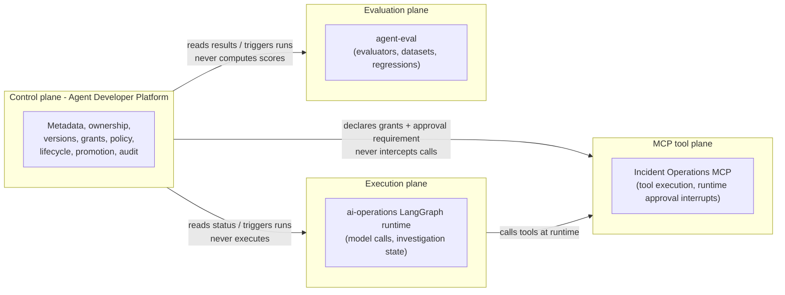

# Control Plane vs. Execution Plane

This is the single most important boundary in the system. Getting it wrong turns this platform into a second runtime, a second evaluator, and a second MCP server - exactly the outcome the brief's non-goals warn against.

## The rule

**The Developer Platform owns metadata about agents. It never owns the thing an agent metadata-describes doing work.**

| Concern | Owned by |
|---|---|
| Agent/AgentVersion/Skill/MCPTool metadata, ownership, grants, policy, lifecycle stage, promotion workflow, audit history | **Agent Developer Platform** |
| Actually running an agent (LangGraph execution, LLM calls, tool invocation) | **The agent's own runtime** (e.g. `ai-operations`' FastAPI + LangGraph service) |
| Executing evaluation cases, computing scores, detecting regressions, storing case-level traces | **Agent Evaluation Platform** (`agent-eval`) |
| Executing MCP tool calls, enforcing runtime approval interrupts | **The MCP server and the calling runtime** (e.g. `ai-operations/mcp_server` + its `l3_approval_gate` node) |

## Why this matters concretely

`ai-operations` already demonstrates what happens when this boundary is blurry even within a single system: model name and prompt text are **global process settings**, not attributes of an investigation - there is no record, per run, of what configuration actually produced it. That's the exact gap this platform exists to close, but closing it means adding a metadata layer *next to* the runtime, not replacing the runtime.

Similarly, `agent-eval`'s `create_ticket`-equivalent problem - its evaluators, dataset snapshotting, and regression comparison already work and are already versioned - means duplicating any of that logic here would create two disagreeing sources of truth for "did this agent regress." The platform reads `agent-eval`'s results; it does not recompute them.

And the Incident Operations MCP server's `create_ticket` write is not reliably gated end-to-end today: the MCP tool itself has a real code-level check that blocks the backend call unless `confirm=True`, but nothing verifies that value reflects genuine human agreement (that part is prompt convention, resting on the calling model), and the backend `POST /v1/tickets` endpoint accepts writes with no confirmation concept at all, bypassable by any caller that skips the MCP tool - both confirmed by direct inspection of `mcp_server/server.py`, `backend/app/api/v1/tickets.py`, and that codebase's own ADR-013. See [`mcp-governance.md`](mcp-governance.md) for the precise three-layer breakdown. This platform does **not** silently assume the gate is airtight. It records `MCPTool.requires_approval = true` as a **governance declaration** - a statement of what *should* be true - and treats actually enforcing it at call time as squarely the execution plane's job, with both known bypass paths documented rather than assumed away. See [`mcp-governance.md`](mcp-governance.md) for the authorization-vs-approval distinction this forces.

## Diagram: plane separation

## What the platform is allowed to do across the boundary

- **Read** from the execution plane and evaluation plane (status endpoints, run results) to populate its own metadata and gate decisions.
- **Trigger** an evaluation run or an agent invocation via their existing APIs - never by reaching into their databases or reimplementing their logic.
- **Record** what it observes (a run completed with these gate results; a version was promoted) as its own first-class, owned data.
- **Declare** governance intent (this tool requires approval; this grant is revoked) that other systems are expected to honor, without the ability to enforce that at the moment of execution.

## What the platform explicitly does not do

- Does not run LangGraph, does not hold LLM credentials for agent execution, does not receive or process investigation state.
- Does not implement evaluators, does not store dataset content or case-level traces, does not compute regression diffs from raw scores - it reads `agent-eval`'s already-computed `dimension_stats` and `regressions` and applies its own policy thresholds to them.
- Does not act as an MCP client or server for tool execution, and does not intercept or proxy tool calls.
- Does not hold a queue of "pending agent-runtime approvals" - that's `ai-operations`' `pending_approvals`/`interrupt()` mechanism, a separate concept from this platform's `PromotionRequest`/`PromotionDecision`, which govern *platform lifecycle* transitions, not *runtime tool-call* approvals.

See [ADR-0001](adrs/0001-control-plane-execution-plane-separation.md) for the full decision record, including the concurrency-plane variant of this argument (why the platform doesn't hold Vertex AI credentials at all - it makes zero LLM calls itself).
