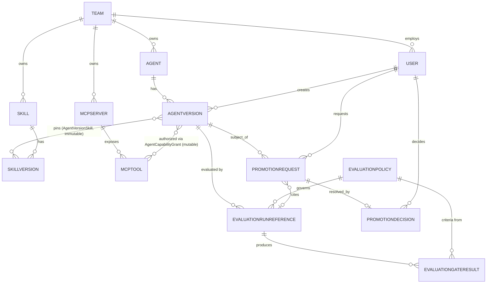

# Domain Model

This model was built by starting from the brief's proposed entity list, then testing each one against what the three inspected systems actually do. Entities that duplicated something a real system already owns were cut or reduced to a reference. See [`adrs/0002-immutable-versioned-artifacts.md`](adrs/0002-immutable-versioned-artifacts.md) and [`adrs/0004-mcp-capability-grant-model.md`](adrs/0004-mcp-capability-grant-model.md) for the reasoning behind the two trickiest parts of this model.

## Entities

### User
`id, name, email, team_id, role, created_at`
Role is one of Viewer/Builder/Reviewer/Admin (global, not per-team — see [`auth-and-approval-model.md`](auth-and-approval-model.md) for why per-team roles were considered and rejected for MVP).

### Team
`id, name, slack_channel?`
Owns agents, skills, and MCP server registrations. Mirrors the `service_ownership` pattern already used in `ai-operations` (team_name, slack_channel), reused for consistency rather than invented fresh.

### Agent
`id, name (unique), team_id, description, created_at`
The long-lived logical identity. Holds no mutable "current config" — see [`agent-versioning.md`](agent-versioning.md). Analogous to `agent-eval`'s `agents` table (`id, name, description, adapter_key`), minus `adapter_key`, which is an execution-plane concern this platform doesn't need.

### AgentVersion
`id, agent_id, version_label, manifest (jsonb), content_hash, source_ref, stage, created_by, created_at, promoted_at?, retired_at?`
One immutable build. `manifest` is the full reproducible definition (see [`agent-manifest.md`](agent-manifest.md)). `content_hash` is a SHA-256 over the canonicalized manifest, used to detect any attempt to mutate a "created" version and to give audit events a stable content reference. `stage` is the **only** mutable field and only moves through the state machine in [`evaluation-and-promotion.md`](evaluation-and-promotion.md). A partial unique index enforces at most one `stage = 'production'` row per `agent_id`.

### Skill
`id, name (unique), owner_team_id, description, created_at`
A reusable capability identity, structurally identical in spirit to Agent — same reasoning for keeping mutable metadata off of it.

### SkillVersion
`id, skill_id, version, owner_user_id, purpose, input_contract, output_contract, implementation_ref, compatible_frameworks[], created_at`
Immutable once published (`skill_version.published` audit event). `implementation_ref` points at the code/config that implements it (e.g. a git ref or a LangGraph node module path) — the platform stores the pointer, not the implementation.

### AgentVersionSkill
`agent_version_id, skill_version_id`
Join table pinning exact skill versions to a version at creation time. Immutable — set once when the `AgentVersion` is created, never edited afterward (consistent with the manifest being frozen).

### MCPServer
`id, name (unique), environment, owner_team_id, connection_ref, health_status, last_health_check_at, created_at`
`connection_ref` is a pointer (e.g. the `BACKEND_URL`-style config `ai-operations/mcp_server` already uses), not a live connection. `health_status` is one of `healthy/degraded/unavailable/unknown`, refreshed by a periodic Cloud Scheduler job (see [`gcp-architecture.md`](gcp-architecture.md)) — never inferred synchronously during a user request.

### MCPTool
`id, mcp_server_id, name, description, io_schema (jsonb), classification, requires_approval, created_at`
`classification` is `read` or `write`. Modeled directly on the Incident Operations MCP server's real tools: `get_investigation_status`, `search_documents`, `get_incident_history` (`classification=read, requires_approval=false`), `create_ticket` (`classification=write, requires_approval=true`).

### AgentCapabilityGrant
`id, agent_version_id, mcp_tool_id, granted_by, granted_at, revoked_by?, revoked_at?`
**Mutable and revocable** — deliberately not part of the immutable manifest. The manifest records what an `AgentVersion` was *built to use*; a grant records what it is *currently authorized to call*. These can diverge (e.g. a grant revoked after a security incident, independent of the version's declared intent). See the capability-revocation failure mode in [`failure-modes.md`](failure-modes.md) and [ADR-0004](adrs/0004-mcp-capability-grant-model.md).

### EvaluationPolicy
`id, name, version, required_evaluator_keys (jsonb), thresholds (jsonb), zero_new_regressions, dataset_key, created_by, created_at`
Versioned and immutable per `(name, version)`, mirroring how `agent-eval` already versions its `Evaluator` rows — same pattern, applied one level up. See [`evaluation-and-promotion.md`](evaluation-and-promotion.md) for the threshold/gate structure.

### EvaluationRunReference
`id, agent_version_id, evaluation_policy_id, external_run_id, external_agent_version_id, requested_by, requested_at, status, dataset_snapshot_hash?, evaluator_versions (jsonb)?, completed_at?, fetched_at?`
A local pointer to a run that actually executed in `agent-eval`. `external_run_id` is `agent-eval`'s `evaluation_runs.id`. `dataset_snapshot_hash` and `evaluator_versions` are copied from `agent-eval`'s response once available, for freshness comparisons. This platform never stores case-level results — those stay in `agent-eval` and are linked to, not duplicated.

### EvaluationGateResult
`id, evaluation_run_reference_id, evaluation_policy_id, criterion, expected, actual, passed, evaluated_at`
The output of applying an `EvaluationPolicy` to an `EvaluationRunReference`'s fetched results. This is what makes gates explicit and inspectable instead of a black-box "quality score" — each row is one named criterion (e.g. `grounding >= 0.85`, `zero_new_regressions`, `evaluator_versions_match_policy`).

### PromotionRequest
`id, agent_version_id, from_stage, to_stage, requested_by, requested_at, evaluation_run_reference_id?, status, reason?`
`status` is `pending/approved/rejected/withdrawn`. Concurrency-safe by design — see [`failure-modes.md`](failure-modes.md).

### PromotionDecision
`id, promotion_request_id, decision, decided_by, decided_at, comment?`
`decided_by != requested_by` is enforced at write time (no self-approval, no exceptions — see [`auth-and-approval-model.md`](auth-and-approval-model.md)).

### AuditEvent
`id, event_type, entity_type, entity_id, actor, occurred_at, payload (jsonb)`
Append-only. See [`audit-model.md`](audit-model.md) for the full event catalog and the transactional-write guarantee.

## Entities considered and rejected

- **Environment** as a first-class entity — every real system inspected (`ai-operations`, `agent-eval`) represents environment as a free-text/enum setting, not a modeled entity with its own lifecycle. `MCPServer.environment` and deployment topology docs cover this without adding a table. Revisit if a second real deployment environment (e.g. staging) actually exists — currently only `MCPServer.environment` needs the concept at all. Tracked in [`open-questions.md`](open-questions.md).
- **ApprovalPolicy** as a dynamic, configurable entity — the brief's non-goals explicitly warn against enterprise-IAM complexity. MVP hardcodes the approval matrix in code (who can approve what) rather than modeling it as data. Tracked as an open question for if/when a second org needs different rules.
- **AgentManifest** as a separate entity — folded into `AgentVersion.manifest` (a JSONB column) rather than a standalone table or object-storage artifact. See [ADR-0003](adrs/0003-manifest-representation-and-storage.md).
- **Ownership** as a separate entity — folded into `owner_team_id` / `owner_user_id` columns on `Agent`, `Skill`, and `MCPServer`. A standalone ownership table would only earn its keep if ownership needed its own history/versioning, which nothing in the brief requires.
- **EvaluationGateResult as part of EvaluationRunReference** — kept as a separate table rather than JSONB columns on the run reference, specifically so gate results survive a policy edit: a `PromotionRequest` links to the exact `EvaluationGateResult` rows that were computed against the exact `EvaluationPolicy` version live at request time, even if that policy is superseded later.

## Diagram: core domain relationships

Summary of the two relationships that are easy to get wrong:

- `AgentVersion` → `Skill`/`MCPTool` is **two different relationships with two different mutability rules**: `AgentVersionSkill` (immutable, pinned at creation) vs. `AgentCapabilityGrant` (mutable, revocable at any time).
- `PromotionRequest` → `EvaluationRunReference` → `EvaluationGateResult` → `EvaluationPolicy` is a chain, not a shortcut: a promotion never reads raw evaluation numbers directly, only gate results that were computed against a specific policy version.
