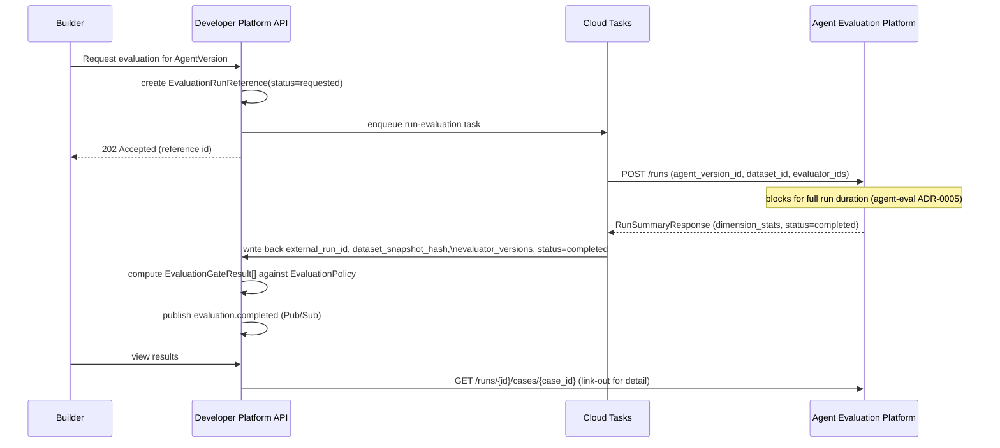
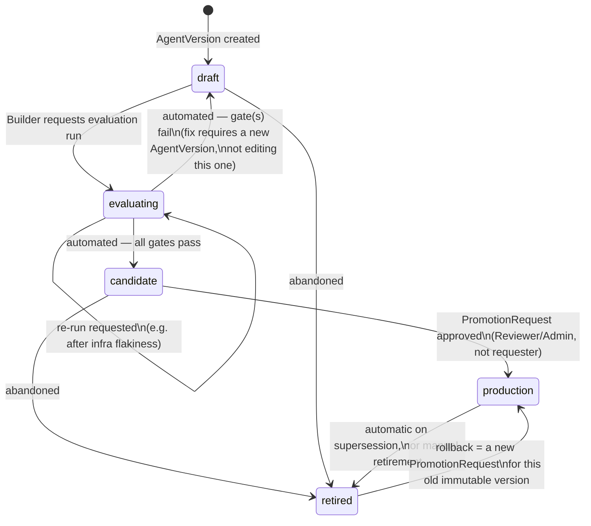
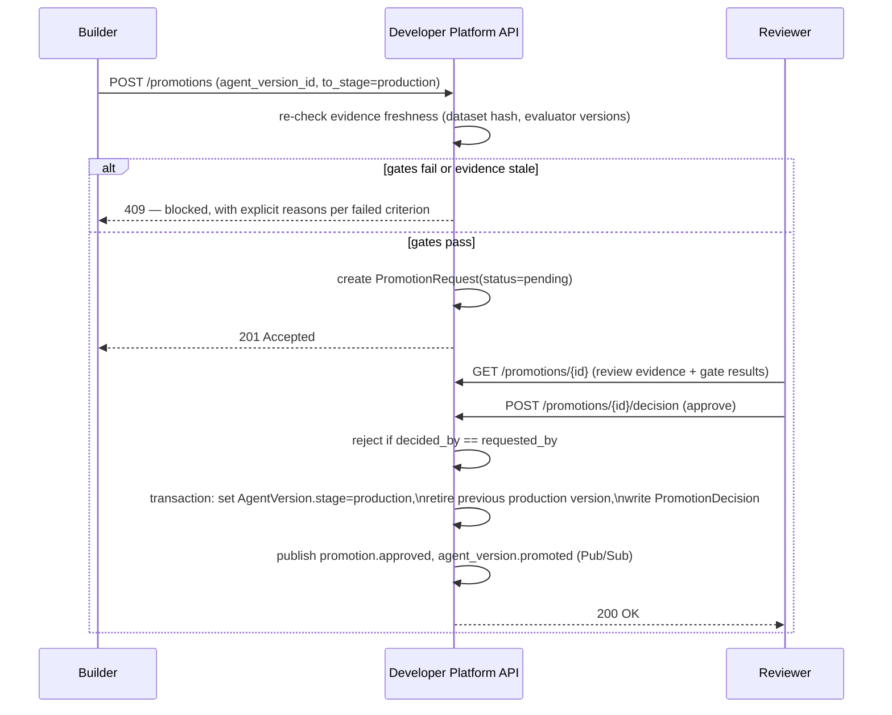

# Evaluation Integration and Promotion Lifecycle

## The integration contract with Agent Evaluation Platform

`agent-eval` remains the only place evaluators execute, datasets live, and regressions are computed. This platform never re-implements any of that (see [`control-plane-boundaries.md`](control-plane-boundaries.md)). It integrates against `agent-eval`'s real, inspected API:

- **Trigger**: `POST /runs` on `agent-eval`, with `agent_version_id`, `dataset_id`, `evaluator_ids[]`.
- **Read results**: `GET /runs/{run_id}` → `dimension_stats[]` (mean score, pass/fail counts per dimension); `GET /runs/compare?run_a_id&run_b_id` → `regressions[]`/`improvements[]`, `evaluator_version_mismatches[]`, `dataset_drift_detected`.
- **Case-level detail**: `GET /runs/{run_id}/cases/{case_run_id}` — this platform links out to it for humans; it never stores case-level data itself.

### The problem this contract has to work around: `POST /runs` is synchronous

Inspection of `agent-eval/backend/app/api/runs.py` confirmed `POST /runs` blocks in-request until the entire run completes — there is no async job/status-polling pattern (an explicit MVP choice in `agent-eval`'s own ADR-0005). `ai-operations`' own eval runner comments note real per-case latency of 60–75 seconds; a full dataset run can run many minutes. This platform's control-plane API must never make this call synchronously from a user-facing request handler — doing so would tie up an API worker and a browser request for the full run duration.

**Resolution**: the platform never calls `POST /runs` directly from the API layer. Requesting an evaluation creates an `EvaluationRunReference(status='requested')` row and enqueues a **Cloud Tasks** job. A worker executes the (still-blocking) `POST /runs` call out-of-band, then writes the response back onto the `EvaluationRunReference` (`external_run_id`, `dataset_snapshot_hash`, `evaluator_versions`, `status='completed'`) and computes `EvaluationGateResult`s. See [`gcp-architecture.md`](gcp-architecture.md) and [ADR-0005](adrs/0005-agent-eval-as-external-source-of-truth.md).

This is a real limitation in a system this platform depends on but does not own fixing (`agent-eval`'s non-goals here explicitly exclude rebuilding it) — noted as a dependency risk in [`open-questions.md`](open-questions.md), not silently worked around as if it weren't real.

### Diagram: evaluation sequence



## The evaluation policy / gate model

`agent-eval` has **no policy or gate concept at all** — confirmed by inspection: no `Policy`/`Gate`/`ThresholdSet` entity, thresholds live only as opaque per-evaluator `config` JSONB, and `GET /runs/compare` is explicitly informational, consumed by nothing. Gating is entirely this platform's responsibility to build, which is exactly the gap the brief identifies (*"do not collapse evaluation results into one opaque quality score"*).

`EvaluationPolicy` (versioned, immutable per `(name, version)` — same pattern as `agent-eval`'s own `Evaluator` versioning):

- `required_evaluator_keys[]` — which evaluators must have run
- `thresholds` — e.g. `{"grounding": {"min_mean": 0.85}, "task_correctness": {"min_mean": 0.90}}`
- `zero_new_regressions: true` — compares against the current `production` version's most recent evaluation for the same `Agent`
- `dataset_key` — which dataset this policy expects

At promotion-request time (not run-request time — see freshness below), the platform computes one `EvaluationGateResult` row per criterion:

| Criterion example | Expected | Actual (from agent-eval) | Passed |
|---|---|---|---|
| `grounding >= 0.85` | 0.85 | 0.91 | true |
| `zero_new_regressions` | 0 | 0 | true |
| `evaluator_versions_match_policy` | matches policy | 1 mismatch found | **false** |
| `dataset_snapshot_current` | current hash | stale | **false** |

A `PromotionRequest` cannot reach `candidate`/`production` if any gate fails. Gates are **hard blockers with no override** in this MVP — see [ADR-0008](adrs/0008-automated-gates-vs-human-approval.md) for why an emergency-override path was deliberately deferred rather than built speculatively.

## Evidence freshness

Freshness is re-checked **live, at promotion-request time**, not frozen at evaluation-run time — because the run itself might be minutes or days old by the time promotion is requested, and both the dataset and the evaluator catalog in `agent-eval` are mutable:

- Dataset: re-fetch `agent-eval`'s current dataset snapshot hash and compare to the one recorded on the `EvaluationRunReference`. Mismatch → `dataset_snapshot_current` gate fails.
- Evaluators: re-fetch `GET /evaluators`, compare versions to what's recorded. Mismatch → `evaluator_versions_match_policy` gate fails.
- Policy: gates are always computed against whichever `EvaluationPolicy` is current for the `Agent` at promotion-request time — if the policy changed since the evaluation ran, the run is simply re-graded against the new policy, and likely fails a threshold it used to pass. The `EvaluationPolicy.id` used is recorded on the `PromotionRequest` for audit, so "which policy actually gated this" is always answerable even after the policy is superseded.

See the full enumeration of stale-evidence and unavailable-dependency scenarios in [`failure-modes.md`](failure-modes.md).

## Promotion lifecycle

```
draft → evaluating → candidate → production → retired
```

### Diagram: promotion state machine



### Legal transitions and who can request them

| Transition | Trigger | Who can request | Evidence required |
|---|---|---|---|
| `draft → evaluating` | Request an evaluation run | Builder, Reviewer, Admin | none |
| `evaluating → candidate` | Automated | System (gate evaluator) | all `EvaluationGateResult`s pass |
| `evaluating → draft` | Automated | System | any gate fails |
| `candidate → production` | `PromotionRequest` approved | Requested by Builder/Reviewer/Admin; approved by Reviewer/Admin **who is not the requester** | fresh, passing gate results cited on the request |
| `candidate → retired` | Abandon | Builder (own team), Reviewer, Admin | none |
| `production → retired` | Retire or superseded | Admin, Reviewer (manual); automatic on a new promotion to `production` for the same `Agent` | none |
| `retired → production` | Rollback | Same as `candidate → production` — a rollback **is** a `PromotionRequest`, not a special transition | see [`open-questions.md`](open-questions.md) on whether freshness rules relax for rollback |

### Only one production version per Agent

Enforced with a database-level partial unique index: `UNIQUE (agent_id) WHERE stage = 'production'`. Promoting a new version to `production` and retiring the previous one happen in a single serializable transaction — see the concurrent-promotion scenario in [`failure-modes.md`](failure-modes.md) for how two simultaneous promotion attempts are resolved.

### What a PromotionRequest captures

`agent_version_id, from_stage, to_stage, requested_by, requested_at, evaluation_run_reference_id, status, reason`, resolved by exactly one `PromotionDecision(decision, decided_by, decided_at, comment)`. Together these make "why did this version reach production" answerable from the `PromotionRequest`/`PromotionDecision`/`EvaluationGateResult`/`EvaluationPolicy` chain alone, without needing to reconstruct anything from `agent-eval` after the fact (though the link to `agent-eval`'s detailed run view is preserved for anyone who wants to go deeper).

### Diagram: promotion sequence


