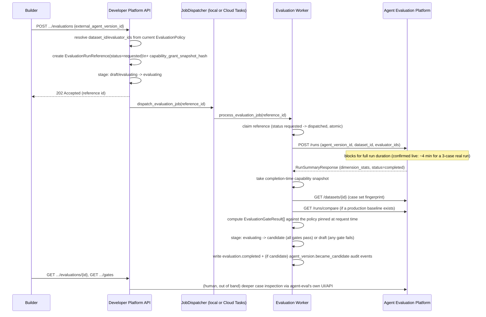
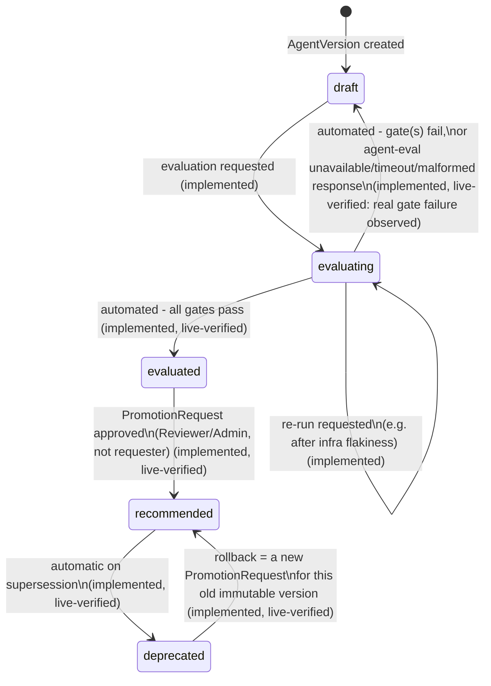

# Evaluation Integration and Promotion Lifecycle

**Status: fully implemented and live-verified, `draft → evaluating → evaluated → recommended → deprecated`, including rollback. `evaluated`/`recommended`/`deprecated` are Phase 8's renamed vocabulary for what Phase 3/4 built as `candidate`/`production`/`retired` - see [`docs/phase-notes/phase-8.md`](phase-notes/phase-8.md) and [ADR-0023](adrs/0023-registry-not-deployment-platform.md); the underlying state machine, `PromotionRequest`/`PromotionDecision` classes, and DB column names are unchanged.**

## The integration contract with Agent Evaluation Platform

`agent-eval` remains the only place evaluators execute, datasets live, and regressions are computed. This platform never re-implements any of that (see [`control-plane-boundaries.md`](control-plane-boundaries.md)). It integrates against `agent-eval`'s real, re-inspected API, implemented in `app/integrations/agent_eval_client.py`:

- **Trigger**: `POST /runs` with `agent_version_id`, `dataset_id`, `evaluator_ids[]`, `triggered_by`, `timeout_seconds` → `RunSummaryResponse` (`dimension_stats[]`, `case_runs[]`, `dataset_snapshot_hash`, `status`).
- **Re-fetch a run**: `GET /runs/{run_id}` (same shape), with an optional `?tag=` filter used by the `zero_failures_for_tag` gate.
- **Compare two runs**: `GET /runs/compare?run_a_id&run_b_id` → `regressions[]`/`improvements[]` (per case/dimension `passed` transitions), `evaluator_version_mismatches[]`, `dataset_drift_detected` - used for the `max_new_regressions` gate.
- **Catalog reads**: `GET /evaluators`, `GET /datasets`, `GET /datasets/{id}` (the latter includes each case's `id`/`key`/`tags`, but never its `input`/`expected` content - see "The dataset-fingerprint limitation" below).
- **Case-level detail**: `GET /runs/{run_id}/cases/{case_run_id}` exists on `agent-eval` but this platform never calls it - only summary evidence (`dimension_stats`, case-completion counts) is stored locally; deep inspection stays a link-out to `agent-eval` for humans.

`agent-eval` is now deployed to Cloud Run (`agent-eval-api`, IAM-authenticated) - see [ADR-0016](adrs/0016-agent-eval-deployment-decision.md) and [`gcp-architecture.md`](gcp-architecture.md). `HttpAgentEvalClient` sends no `Authorization` header at all against an unauthenticated local instance, and a real Google-signed ID token (`google.oauth2.id_token`/`google.auth.impersonated_credentials`) against the deployed one - live-verified both ways (`docs/phase-notes/phase-3.md`).

### The problem this contract has to work around: `POST /runs` is synchronous

Confirmed still true against the real deployed service: a 3-case `incident-investigator` run took ~3.5–4 minutes end to end (real LangGraph + Vertex AI Gemini calls). This platform's API layer must never make this call synchronously from a user-facing request handler.

**Resolution, as actually implemented**: `POST /v1/agent-versions/{id}/evaluations` (`app/api/evaluations.py`) does none of the slow work itself - it resolves the dataset/evaluator identities (fast, local-catalog lookups), creates `EvaluationRunReference(status='requested')`, transitions the version to `evaluating`, and returns `202` immediately. The actual `POST /runs` call happens in `app/services/evaluation_worker.py::process_evaluation_job`, dispatched via `app/services/job_dispatch.py`. See "Async dispatch: what's real and what isn't" below for exactly which half of this is production-shaped and which half is a documented test/dev stand-in.

### Async dispatch: what's real and what isn't

Two implementations of the same `JobDispatcher` interface exist, and this phase used both for different purposes - conflating them would be exactly the "do not pretend a local in-process call is Cloud Tasks" mistake the brief warned against:

- **`LocalSyncDispatcher`** (`app/services/job_dispatch.py`) - fires the worker via `asyncio.create_task`, non-blocking but **not durable**: no retry on failure, no persistence across a process restart, no delivery guarantee. This is what every automated test and both live demos this phase actually ran against (`docs/phase-notes/phase-3.md`).
- **`CloudTasksDispatcher`** - the real production implementation, using `google-cloud-tasks` to create a genuine HTTP task targeting `POST /internal/tasks/evaluations/{id}` (`app/api/tasks.py`). **Fully live-verified as of Phase 6**, end to end: a real evaluation request created a real task on the `evaluation-jobs` queue, the deployed API received and processed the push, called the real deployed `agent-eval-api`, and the reference reached `status: completed` with real gate results - all without manual intervention. Receiver authentication is real, application-level OIDC verification (`app/auth/cloud_tasks.py`, [ADR-0021](adrs/0021-cloud-tasks-application-level-push-auth.md)), not Cloud Run ingress IAM - that plan turned out to be architecturally impossible once the same service also had to accept user JWTs on the same `Authorization` header. Duplicate-delivery idempotency and failed-task (non-retried) behavior were also live-verified this phase - see `docs/phase-notes/phase-6.md`.

`app/dependencies.py::get_job_dispatcher` selects between them via `settings.job_dispatch_mode` (`"local"` default, `"cloud_tasks"` in the deployed environment).

### Diagram: evaluation sequence



## The evaluation policy / gate model

`agent-eval` has **no policy or gate concept at all** - reconfirmed against the deployed service in Phase 3: no `Policy`/`Gate`/`ThresholdSet` entity, `GET /runs/compare` remains informational. Gating is entirely this platform's responsibility (`app/services/gates.py`), computed once per completed run and persisted as one `EvaluationGateResult` row per criterion - never a blended score.

`EvaluationPolicy` is **fully immutable** as of Phase 3 (DB-level `UPDATE`/`DELETE` revoked, matching `AgentVersion`/`SkillVersion` - [ADR-0015](adrs/0015-evaluation-policy-immutability.md)):

- `thresholds` - `{"<dimension>": {"min_mean": <float>}, ...}` - one `min_dimension_score` gate per entry.
- `required_evaluator_keys` - `{"<evaluator_key>": "<required_version>", ...}` - one `required_evaluator_version` gate per entry, checked against what was *actually submitted* to `agent-eval` at request time (not re-fetched live - that's freshness's job, below).
- `max_new_regressions` (int, default `0`) - one `max_new_regressions` gate, comparing against the current recommended version's most recent completed evaluation on the same dataset. **Trivially passes** with no baseline if no recommended version exists yet for the agent - confirmed both in tests and live (Phase 3's real `incident-investigator` demo had no baseline and passed this gate with reason "no recommended baseline evaluation exists yet", under the terminology current at the time of writing).
- `zero_failure_tags` (list of case tags) - one `zero_failures_for_tag` gate per tag, `0` rows if the list is empty (no criterion configured, no gate to check).
- `min_completion_rate` (default `1.0`) - one `min_completion_rate` gate, computed from `case_runs[].status`.
- **`capability_snapshot_consistency`** (always computed, not policy-configurable) - compares the capability-grant snapshot hash taken at evaluation-*request* time against a fresh one taken at *completion* time, catching "capability grants changed while evaluation was running" ([`failure-modes.md`](failure-modes.md)). Live-verified as a real failure trigger in `tests/test_evaluation_worker.py`.
- `dataset_key` - resolves to a real `agent-eval` dataset by name at request time; not itself a gate, but the input to the dataset-identity freshness check below.

A version becomes `candidate` only if **every** gate for that run passed - `all(g.passed for g in computed_gates)`, computed once, right when the run completes (`app/services/evaluation_worker.py::_persist_success`). Gates are **hard blockers with no override**, per [ADR-0008](adrs/0008-automated-gates-vs-human-approval.md) - unchanged in Phase 3.

**Live-verified, real example** (`docs/phase-notes/phase-3.md`): `incident-investigator`'s first real policy (`v1`) required an evaluator (`final_output_contains_keywords`) that turned out to produce no applicable score for the real dataset's case shape - a genuine `min_dimension_score` gate failure, not a bug, correctly blocking `candidate`. Because policies are immutable, the fix was publishing `v2` with a corrected `required_evaluator_keys`, not editing `v1` - and re-running against it produced 11/11 passing gates and a real `candidate` transition.

## Evidence freshness

`app/services/freshness.py::check_freshness` draws the exact distinction the brief calls for: **"evaluation passed at the time"** (a permanent historical fact - `EvaluationGateResult.passed`, never recomputed) vs. **"evidence is still valid for promotion now"** (computed live, every call, never stored). A version can be `stage=evaluated` while `currently_eligible=false`.

Computed live against the most recent evaluation run whose gates all passed:

| Stale reason | How it's detected | Precision |
|---|---|---|
| `capability_grants_changed` | Re-take the capability-grant snapshot now; compare hash to the one stored on the passing run reference | Exact - this platform's own data |
| `evaluator_version_changed` | Re-fetch `GET /evaluators` now; compare each required evaluator's current version to what was recorded at request time | Exact - live catalog read |
| `missing_required_evaluator` | A required evaluator key no longer exists in the live catalog at all | Exact |
| `policy_changed` | Compare the passing run's `evaluation_policy_id` to whatever `get_current_policy_for_agent` resolves to now | Exact - this platform's own data |
| `dataset_changed` | See "The dataset-fingerprint limitation" below | **Approximate, and named as such** |

### The dataset-fingerprint limitation

A real, load-bearing finding from Phase 3 implementation, not a hypothetical: `GET /datasets/{id}` (agent-eval's real, re-confirmed schema) returns each case's `id`/`key`/`tags` only - **never** its `input`/`expected` content, which is what agent-eval's own `dataset_snapshot_hash` is actually computed over, server-side, only as part of a `RunSummaryResponse`. There is no standalone "give me the current dataset hash" endpoint. Reconstructing agent-eval's exact hash client-side would mean reimplementing its dataset-hashing logic, which the Phase 3 brief explicitly forbids ("do not reimplement... dataset logic").

The honest resolution: `dataset_case_set_fingerprint` (`app/services/freshness.py`) is a **distinctly-named, deliberately weaker** platform-computed proxy - a hash over sorted `{key, tags}` pairs. It reliably catches cases added, removed, renamed, or re-tagged. It **cannot** detect a case's `input`/`expected` content changing while its key stays the same. This limitation is stated everywhere the fingerprint is used (code comments, this doc, `docs/failure-modes.md`, `docs/open-questions.md`) - never presented as equivalent to agent-eval's own hash. Tracked as a named ask for `agent-eval` to expose a real current-hash endpoint (`docs/open-questions.md`).

See the full enumeration of stale-evidence and unavailable-dependency scenarios in [`failure-modes.md`](failure-modes.md).

## Promotion lifecycle

```
draft → evaluating → evaluated → recommended → deprecated
```

**Fully implemented as of Phase 4** (renamed from `candidate`/`production`/`retired` in Phase 8 - vocabulary only, no behavior change). `evaluated → recommended` (human `PromotionRequest`/`PromotionDecision` approval), rollback, and auto-deprecate-on-supersession all exist (`app/services/promotions.py`). `evaluated/recommended → deprecated` as an explicit *manual abandon/retire* action (independent of supersession) is the one edge from Phase 0's original diagram not built - see the scope note below.

### Diagram: promotion state machine



### Legal transitions and who can request them

| Transition | Trigger | Who can request | Evidence required | Status |
|---|---|---|---|---|
| `draft/evaluating → evaluating` | Request an evaluation | Builder (own team), Reviewer, Admin | none | Implemented, live-verified |
| `evaluating → evaluated` | Automated | System (gate evaluator) | all `EvaluationGateResult`s pass | Implemented, live-verified |
| `evaluating → draft` | Automated | System | any gate fails, or agent-eval call fails | Implemented, live-verified |
| `evaluated → recommended` | `PromotionRequest` approved | Requested by Builder/Reviewer/Admin; approved by Reviewer/Admin **who is not the requester** | fresh, passing gate results cited on the request; re-checked live again at decision time | Implemented, live-verified |
| `recommended → deprecated` | Automatic, on a new promotion superseding it | System, as part of the new promotion's transaction | none | Implemented, live-verified |
| `deprecated → recommended` | Rollback - an ordinary `PromotionRequest` for this old immutable version | Same as `evaluated → recommended` | same as `evaluated → recommended`, no exception (`docs/open-questions.md` #2, resolved) | Implemented, live-verified |

`evaluated/recommended/deprecated` versions cannot have a new evaluation requested against them (`app/services/evaluations.py::_REQUESTABLE_STAGES = {DRAFT, EVALUATING}`) - live and test-verified to return `409`. A version stuck in `evaluated` that later needs re-validation goes through the ordinary route: a new `AgentVersion`.

**Not built: a standalone, manual `evaluated/draft → deprecated` "abandon" action.** Phase 0's diagram included it; the Phase 4 brief's actual scope (promotion requests, review, production promotion, rollback, audit) didn't ask for it, and every scenario this phase needed to demonstrate (including rollback, which needs a `deprecated` version to roll back *to*) is reachable through `recommended → deprecated` supersession alone. The only way to reach `deprecated` as of Phase 4 is by being superseded after having been `recommended` - an `evaluated` version that's simply abandoned (never promoted) has no way to leave `evaluated` yet other than a fresh `AgentVersion` superseding it in spirit (the old one just stays `evaluated`, inert). A small, real gap, not a silent one - worth adding if a real workflow need for it shows up.

### Decision-time freshness: "eligible when requested" vs "eligible when reviewed"

Freshness (`app/services/freshness.py::check_freshness`) is checked live **twice**, not once: at `PromotionRequest` creation (blocking the request outright if not currently eligible - `docs/adrs/0008-automated-gates-vs-human-approval.md`), and again, independently, immediately before a Reviewer's `approve`/`reject` decision. Both results are frozen, permanent facts - `PromotionRequest.freshness_snapshot` and `PromotionDecision.freshness_snapshot_at_decision` respectively (`docs/adrs/0018-promotion-request-immutability.md`). If evidence drifts stale in the gap between filing and review (a capability grant revoked, the policy superseded, an evaluator version bumped), **approval is blocked** - `ConflictError`, a `promotion.approval_blocked_stale` audit event, and no lifecycle mutation whatsoever. Nothing is silently rerun or auto-invalidated: the request simply stays `pending` until a Reviewer explicitly rejects it (rejection is never blocked by staleness - a Reviewer may reject for any reason, and the freshness snapshot is still recorded for auditability even then).

### Concurrency: an advisory lock, not `SERIALIZABLE`

Two decisions racing to promote different candidates of the same `Agent` (or double-deciding the same request) are serialized via `pg_advisory_xact_lock(hashtext(agent_id))`, taken at the start of `approve_promotion`/`reject_promotion` before re-reading the request's status - not a row-level `SELECT ... FOR UPDATE` (one approval can touch two `AgentVersionLifecycle` rows: the newly-promoted version's and the previously-recommended version's, and the latter may not exist yet when the lock must already be held) and not `SERIALIZABLE` isolation (the hazard is a plain concurrent-UPDATE conflict, not a phantom-read anomaly, so the retry-loop machinery `SERIALIZABLE` requires isn't needed). The partial unique index (`UNIQUE (agent_id) WHERE stage='recommended'`) remains the final DB-level backstop. See [ADR-0007](adrs/0007-promotion-state-machine.md)'s Phase 4 update for the real bug this surfaced (deprecating the old recommended row and promoting the new one must be two separately-flushed statements, in that order - Postgres checks the partial unique index immediately per row, not deferred to transaction end) and `tests/test_promotions.py::test_concurrent_approvals_for_same_agent_only_one_ends_in_production` for the real two-session proof (test name predates the Phase 8 rename and was left as-is - see [ADR-0023](adrs/0023-registry-not-deployment-platform.md) on not renaming things the literal word wasn't the source of the problem for).

### Promotion lifecycle events

`agent_version.promoted` is fanned out via a transactional outbox (`OutboxEvent`, written in the same transaction as the recommended transition) to a real Pub/Sub topic (`agent-platform-events`, per [ADR-0011](adrs/0011-pubsub-vs-cloud-tasks.md)) - see [ADR-0020](adrs/0020-promotion-lifecycle-event-outbox.md) for the pattern and what was live-verified (real publish, real delivery confirmed via a real subscription pull). No real subscriber service exists yet, same open gap as Cloud Tasks' evaluation-dispatch queue.

### Only one recommended version per Agent

Unchanged from Phase 1/2: `UNIQUE (agent_id) WHERE stage = 'recommended'` on `AgentVersionLifecycle` (`'production'` before the Phase 8 rename). Exercised end-to-end in Phase 4 - see the concurrency section above and `docs/phase-notes/phase-4.md`'s live verification (a real recommended-version supersession and a real rollback both went through this exact constraint).

## Live verification summary

Both required Phase 3 workflows were run against the real deployed `agent-eval-api` Cloud Run service, not a local stand-in - full transcript in [`docs/phase-notes/phase-3.md`](phase-notes/phase-3.md):

1. **Passing flow**: the real `incident-investigator@4.2.0` AgentVersion → real evaluation request → real ~4-minute `agent-eval` execution (LangGraph + Vertex AI Gemini) → 11/11 gates computed and passed → `stage: evaluated` (`candidate` at the time this test ran, before the Phase 8 rename), `currently_eligible: true`.
2. **Stale/blocked flow**: revoked a real `AgentCapabilityGrant` on that same version → the historical evaluation run's gates remain unchanged (`all_passed: true`) and `stage` remains unchanged → but `GET .../candidacy` now reports `currently_eligible: false` with an explicit `capability_grants_changed` stale finding, including the before/after hash.

This is the "major architectural proof point" the brief called for, observed live rather than only reasoned about.
