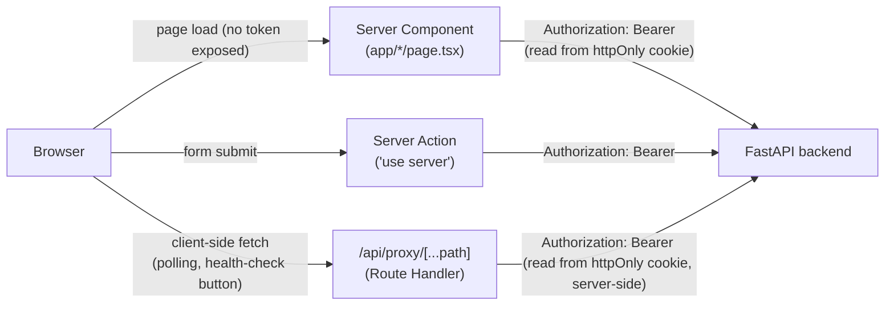

# Frontend Architecture

Phase 5. Next.js 16 (App Router), TypeScript, Tailwind CSS v4. No client-state framework (Redux/Zustand/React Query) - state lives in the URL, in Server Component data fetching, and in a handful of `useState`/`useActionState` calls for the few genuinely interactive widgets (login, evaluation polling, approve/reject, promotion request forms). See "Why no client-state framework" below for why this held up.

## Information architecture

Six top-level sections, chosen to avoid the brief's warning against "excessive top-level sections when some belong naturally inside agent detail":

- **Overview** - the signed-in user's dashboard: counts, a live "Needs Attention" list, recent activity.
- **Agents** - catalog → agent detail → `AgentVersion` detail. Evaluation and promotion are *not* separate top-level sections - both live inside `AgentVersion` detail, where they're actually meaningful (evaluation evidence and promotion eligibility are properties of one specific version, not something to browse independently of it).
- **Skills** - registry → skill detail (versions, exact pinning by `AgentVersion`).
- **MCP** - registry → server detail (tools, classification, approval requirement, live health check, reverse lookup of which `AgentVersion`s hold a grant).
- **Promotions** - the reviewer queue (`?status=pending` by default) and full history, plus the request-review/approve/reject detail page.
- **Activity** - the global `AuditEvent` feed, filterable by entity type.

`AgentVersion` detail (`app/agents/[agentId]/versions/[versionId]/page.tsx`) is deliberately the largest, densest page - it's the reproducibility/debugging surface the brief calls "one of the strongest product screens": configuration (manifest), skills, MCP access, evaluation (gate results, freshness), lifecycle stage, and promotion evidence, all in one place, because that's the actual unit someone reasons about when asking "can I trust this version."

## Request flow: server-first, one proxy for interactivity

Every request to the backend carries a real JWT, attached server-side. The token itself never reaches browser JavaScript - it lives only in an `httpOnly` cookie (`orion_token`), set by `app/api/auth/login/route.ts` after a real login exchange and read by `lib/api.ts`'s `apiFetch` (Server Components/Actions) or `app/api/proxy/[...path]/route.ts` (client-initiated calls). This is also why the backend needed **no CORS configuration change** for Phase 5: every request it receives is same-origin, from the Next.js server itself, whether it originated from a Server Component's initial render or a client component's `fetch('/api/proxy/...')` call.

Three data-access patterns, used for exactly what each is good at:

1. **Server Components** (`lib/api.ts::apiGet`) - the default for every page's initial data. Runs on the server, no loading spinner needed for first paint, the token never leaves the server.
2. **Server Actions** (`'use server'` files named `actions.ts`, one per feature) - every mutation: request evaluation, request promotion, approve, reject. A plain HTML `<form action={...}>` works even without JS; `useActionState` (React 19) wires up pending/error state for the actual UI. `revalidatePath` refreshes the affected pages after a successful mutation - no manual cache invalidation.
3. **The proxy Route Handler** - for the few things a Server Action/full-page reload genuinely can't do: polling an in-flight evaluation's status every few seconds, and one-off client-triggered actions (the MCP health-check button) where a full navigation would be worse UX than an inline optimistic-ish update. This is the only place client-side `fetch` is used against real backend data.

## Auth integration - real, not mocked

The brief is explicit: "Do not implement fake auth solely for frontend development." What's built:

- `/login` lets a developer pick one of the four seeded Orion Commerce users and calls `POST /v1/dev-login` (`backend/app/api/dev_auth.py`) - a Phase 5 addition, but not a new *kind* of auth: it mints a token using the exact same RS256 signing logic `scripts/dev_login.py` has used since Phase 1 (extracted to `backend/app/auth/dev_tokens.py` so script and endpoint share one implementation), and that token is verified by the exact same `get_current_user` dependency every other authenticated endpoint uses (`StaticJWKSProvider` in dev, `RemoteJWKSProvider` against real Identity Platform in production).
- The dev-login endpoint only exists when the backend is configured with `AUTH_JWKS_FILE` (dev/test key-file mode) - in a real deployment (`RemoteJWKSProvider`, no local signing key), the route is never registered (`backend/app/main.py`), so there is no way to reach it in production.
- **Phase 6**: `/login` detects which situation it's in (`getDevLoginState()` in `app/login/page.tsx` - distinguishes a genuine network failure from dev-login's real `404` from real dev users existing) and renders `PasswordLoginForm` (`app/login/PasswordLoginForm.tsx`) whenever dev-login isn't available. That form posts to `app/api/auth/login-password/route.ts`, a real Route Handler that calls Identity Platform's `accounts:signInWithPassword` REST endpoint directly (a public, API-target-restricted key - safe to be public, it can only initiate sign-in) and sets the same httpOnly session cookie dev-login uses. The resulting token is genuine, Google-signed, and verified by the same unmodified `RemoteJWKSProvider` path - live-verified end to end through the real deployed frontend and backend, not just reasoned about.
- `lib/auth.ts::getSession()` never trusts the cookie's mere presence - it calls the real `GET /v1/me` and only considers the user signed in if that call succeeds. There is no separate frontend notion of "who is logged in."
- `proxy.ts` (Next 16 renamed "Middleware" to "Proxy") does one cheap check - cookie presence - to redirect obviously-signed-out visitors to `/login` before rendering anything; it is explicitly *not* the authorization boundary (the brief: "Backend remains authoritative. Hiding the button is not authorization.") Every page still calls `requireSession()`, and every mutation still hits the backend's real permission check regardless of what the UI decided to show.

## Frontend/backend boundary

The frontend adds **zero new domain logic**. `lib/permissions.ts` mirrors `backend/app/services/permissions.py`'s decision functions (`canRequestPromotion`, `canDecidePromotion`, etc.) - used only to decide what to render (don't show an Approve button that will just 403), never as the actual gate. A handful of new backend read endpoints were added because the frontend needed aggregated views the domain layer already had the pieces for but no single endpoint assembled (`docs/api-reference.md`'s Phase 5 additions: global audit events, the global promotion-request reviewer queue, the MCP-tool-grants reverse lookup, the dashboard summary, and enriched `Agent` list/detail responses) - each is a **display join** over existing service-layer functions, not new business rules, the same way `app/api/promotions.py::_enrich_with_context` (Phase 4) already was.

## Error/loading states

Every backend call returns a typed `ApiResult<T>` (`lib/api.ts`) - `{ ok: true, data }` or `{ ok: false, status, message }` - never a thrown exception a page could accidentally leak to the user as a raw stack trace. Each page decides what "not ok" means for it:

- **Auth failure / expired session** - `requireSession()` redirects to `/login`.
- **API unavailable** - `apiFetch`'s catch block turns a network failure into `{ ok: false, status: 0, message: "The Orion API is unreachable..." }`, rendered as an inline `ErrorPanel`, not a crashed page.
- **Evaluation running / failed** - `RunStatusBadge` renders discrete states (Queued/Running/Completed/Failed) from the real `EvaluationRunReference.status` - never a fake progress percentage, per the brief's explicit instruction.
- **Stale evidence** - see "Freshness UX" below; a dedicated visual treatment, not an error state at all.
- **Promotion conflict / concurrent approval conflict** - `requestPromotionAction`/`approvePromotionAction` surface the backend's real `409` message inline in the form (e.g. "promotion request ... is no longer eligible for approval: dataset_changed, capability_grants_changed") - live-verified in `docs/phase-notes/phase-5.md`.
- **Unauthorized action** - the review page shows *why* a reviewer can't act ("You cannot approve your own request.") instead of hiding the section silently, and a direct POST that the backend rejects with `403` surfaces that message the same way a `409` does.
- **MCP health unavailable** - `MCPHealthStatus` includes `unavailable`/`unknown`/`degraded` as real, renderable states (`HealthBadge`), not just `healthy`/broken.

## Freshness UX

The core differentiator, given deliberate visual treatment (`FreshnessDisplay`, `app/agents/[agentId]/versions/[versionId]/PromotionSection.tsx`): "Evaluation: Passed" and "Current eligibility: Stale" are always rendered as two separate facts, never collapsed into one. A historically-passing evaluation that has since gone stale is never shown as failed - an explanatory note makes the distinction explicit, and every stale reason is rendered individually (never a generic "stale" boolean), matching the exact reasons `check_freshness` computes (`capability_grants_changed`, `dataset_changed`, `policy_changed`, `evaluator_version_changed`, `missing_required_evaluator`). The promotion review page shows this same distinction twice more: "Eligible when requested" (frozen at request time) and "Eligible now"/"Eligible when reviewed" (live or frozen at decision time), mirroring `docs/adrs/0018-promotion-request-immutability.md`'s two-snapshot model directly.

## Why no client-state framework

Every page's primary data is fetched once, server-side, per navigation - there is no client-side cache to keep in sync across components, no optimistic-update graph, no cross-page shared mutable state. The few things that genuinely need client interactivity (a form's pending/error state, an in-flight evaluation's polling) are handled by React's own `useState`/`useActionState`/`useTransition`, each scoped to one component. Introducing Redux/Zustand/TanStack Query would add an indirection layer with nothing real to synchronize - consistent with the brief's explicit instruction not to reach for one unless an actual interaction requires it.

## Testing

Vitest + React Testing Library (`frontend/**/*.test.ts(x)`), scoped to what's practical to unit-test without standing up a full Next.js server: pure permission logic (`lib/permissions.test.ts` - every role/self-approval combination), badge/status rendering (`components/Badge.test.tsx`), the freshness distinction (`PromotionSection.test.tsx`), gate-failure rendering (`EvaluationSection.test.tsx`), rollback/event-history rendering (`ActivityFeed.test.tsx`), and the approve/reject UI (`ReviewActions.test.tsx`). Full page-level and end-to-end flows (agent browsing, live evaluation runs, promotion request → review → approval → production transition, the stale-block path) are verified against the real running backend/database/deployed `agent-eval-api` instead - a real Next dev server exercised through Chrome, not simulated - see `docs/phase-notes/phase-5.md`'s live verification section for the full transcript. Server Components and Server Actions (which need cookies/fetch/the real Next.js runtime) are intentionally left to that live verification rather than mocked into a unit test that would prove little beyond "the mocks are consistent with each other."
