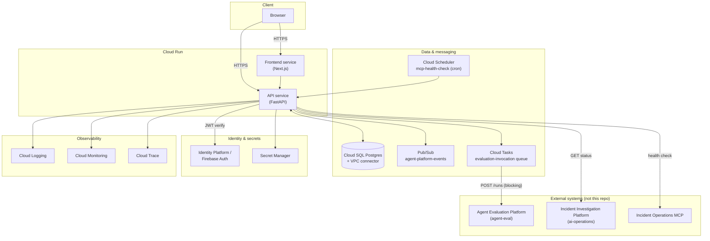

# GCP Architecture

Every service below has a stated reason to exist, tied to a specific requirement elsewhere in these docs - none are included for coverage. Where a real, inspected system already uses a pattern (Cloud Run + Cloud SQL + VPC connector in `ai-operations`), this platform reuses it rather than inventing an alternative.

## Services and why each exists

| Service | Reason |
|---|---|
| **Cloud Run** (frontend + API) | Matches `ai-operations`' proven, live deployment pattern (`gcloud run deploy`). Stateless FastAPI/Next.js services, no reason to run anything heavier. |
| **Cloud SQL (PostgreSQL)** | Control-plane data of record - agents, versions, manifests, grants, policies, promotions, audit. Relational integrity (foreign keys, the `UNIQUE (agent_id) WHERE stage='production'` partial index on `AgentVersionLifecycle`, transactional audit writes) is load-bearing here, not incidental - see [`failure-modes.md`](failure-modes.md) and [`audit-model.md`](audit-model.md). |
| **Identity Platform / Firebase Auth** | This platform is the first of the four systems to need real authentication - see [`auth-and-approval-model.md`](auth-and-approval-model.md). Issues the JWT the API verifies on every request. |
| **Pub/Sub** | Fan-out of domain/lifecycle events (`promotion.approved`, `capability.revoked`, etc.) to downstream consumers, decoupled from the request path - an outbox pattern after transactional Postgres writes. See [`audit-model.md`](audit-model.md). Not used for anything synchronous. |
| **Cloud Tasks** | The one place this platform genuinely needs durable, retryable, long-running background execution: invoking `agent-eval`'s synchronous, multi-minute `POST /runs` without blocking an API request. See [`evaluation-and-promotion.md`](evaluation-and-promotion.md). **This row describes the intended deployed target, not current reality** - `agent-eval` has no Cloud Run deployment today (`agent-eval/infra/` is a bare Postgres `docker-compose.yml`) and no service-to-service auth exists on either side. Real Cloud Tasks → deployed-`agent-eval` traffic is an explicit prerequisite for Phase 3, not an assumption baked into this row - see [`evaluation-and-promotion.md`](evaluation-and-promotion.md#prerequisite-agent-eval-must-actually-be-reachable-from-this-platforms-cloud-environment). |
| **Cloud Scheduler** | Periodic MCP server health checks (`MCPServer.health_status`). This is recurring, not event-triggered, work - the reason it's Scheduler and not Cloud Tasks; see the Pub/Sub-vs-Cloud-Tasks distinction below. |
| **Secret Manager** | `DATABASE_URL`, service credentials for calling `agent-eval`/`ai-operations`, Firebase service account. Same role it already plays in `ai-operations`. |
| **Cloud Logging / Monitoring / Trace** | Standard operational visibility; `ai-operations` already wires OpenTelemetry → Cloud Trace, and this platform's API does the same for consistency and because promotion/evaluation flows span multiple async hops worth tracing end-to-end. |

## Explicitly not used

- **Cloud Storage** - manifests are small, structured JSONB that belongs in Postgres transactionally; see [ADR-0003](adrs/0003-manifest-representation-and-storage.md). No large binary artifacts exist in this system's domain to justify object storage.
- **Vertex AI / any LLM provider** - this platform makes no model calls itself. See [ADR-0013](adrs/0013-no-first-party-model-usage.md).
- **Kubernetes** - explicit non-goal; Cloud Run covers the actual scaling/traffic needs of a stateless CRUD+orchestration control plane.

## Pub/Sub vs. Cloud Tasks - kept genuinely separate

These are easy to conflate and the brief specifically calls out not to. The distinguishing question this design uses: **is this "notify anyone interested that X happened" (Pub/Sub) or "this one specific operation must durably complete, possibly after retries, independent of the request that triggered it" (Cloud Tasks)?**

- Pub/Sub: `agent_version.promoted`, `capability.revoked`, `evaluation.completed`, etc. - fan-out, at-least-once, no expectation any particular consumer exists yet.
- Cloud Tasks: "run this evaluation via `agent-eval`'s blocking API and write the result back" - a single owned operation with a single owned outcome, needing retry/backoff semantics, not a broadcast.
- Cloud Scheduler: periodic MCP health checks - recurring on a clock, not triggered by a domain event; publishes a Pub/Sub message or invokes a Cloud Run job on schedule, doesn't belong in either of the above buckets.

See [ADR-0011](adrs/0011-pubsub-vs-cloud-tasks.md).

## Diagram: deployment topology

