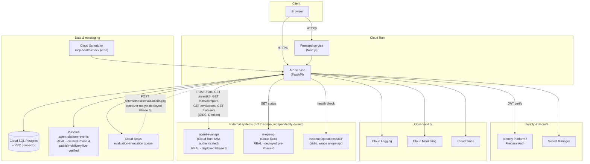

# GCP Architecture

Every service below has a stated reason to exist, tied to a specific requirement elsewhere in these docs - none are included for coverage. Where a real, inspected system already uses a pattern (Cloud Run + Cloud SQL + VPC connector in `ai-operations`), this platform reuses it rather than inventing an alternative.

## Services and why each exists

| Service | Reason |
|---|---|
| **Cloud Run** (frontend + API) | Matches `ai-operations`' proven, live deployment pattern (`gcloud run deploy`). Stateless FastAPI/Next.js services, no reason to run anything heavier. |
| **Cloud SQL (PostgreSQL)** | Control-plane data of record - agents, versions, manifests, grants, policies, promotions, audit. Relational integrity (foreign keys, the `UNIQUE (agent_id) WHERE stage='production'` partial index on `AgentVersionLifecycle`, transactional audit writes) is load-bearing here, not incidental - see [`failure-modes.md`](failure-modes.md) and [`audit-model.md`](audit-model.md). |
| **Identity Platform / Firebase Auth** | This platform is the first of the four systems to need real authentication - see [`auth-and-approval-model.md`](auth-and-approval-model.md). Issues the JWT the API verifies on every request. |
| **Pub/Sub** | Fan-out of domain/lifecycle events, decoupled from the request path - a real transactional outbox (`OutboxEvent`) after transactional Postgres writes. See [`audit-model.md`](audit-model.md), [ADR-0020](adrs/0020-promotion-lifecycle-event-outbox.md). Not used for anything synchronous. **Real as of Phase 4**: the `agent-platform-events` topic exists in `ai-ops-center-eb26`; `PubSubPublisher` was proven to publish a real message and a real subscription pull confirmed actual delivery (stronger than Cloud Tasks' proof below, since Pub/Sub delivery doesn't require a running consumer service to verify). Scoped to `agent_version.promoted` only this phase, not the full event catalog. No real subscriber *service* exists yet - same open gap as Cloud Tasks' receiver, Phase 6. |
| **Cloud Tasks** | The one place this platform genuinely needs durable, retryable, long-running background execution: invoking `agent-eval`'s synchronous, multi-minute `POST /runs` without blocking an API request. See [`evaluation-and-promotion.md`](evaluation-and-promotion.md). **Partially real as of Phase 3**: a real queue (`evaluation-jobs`, `us-central1`) exists and `CloudTasksDispatcher` was proven to create and enqueue real tasks against it (`gcloud tasks list` independently confirmed real delivery attempts). Not yet exercised end-to-end, because the push target - this platform's own API - isn't deployed to Cloud Run yet (Phase 6). Every automated test and both live Phase 3 demos used `LocalSyncDispatcher` instead (non-durable, in-process) - see [`evaluation-and-promotion.md`](evaluation-and-promotion.md#async-dispatch-whats-real-and-what-isnt) for the precise, current boundary. |
| **Cloud Scheduler** | Periodic MCP server health checks (`MCPServer.health_status`). This is recurring, not event-triggered, work - the reason it's Scheduler and not Cloud Tasks; see the Pub/Sub-vs-Cloud-Tasks distinction below. |
| **Secret Manager** | `DATABASE_URL`, service credentials for calling `agent-eval`/`ai-operations`, Firebase service account. Same role it already plays in `ai-operations`. |
| **Cloud Logging / Monitoring / Trace** | Standard operational visibility; `ai-operations` already wires OpenTelemetry → Cloud Trace, and this platform's API does the same for consistency and because promotion/evaluation flows span multiple async hops worth tracing end-to-end. |

## agent-eval's real Cloud Run deployment (Phase 3)

Deployed per [ADR-0016](adrs/0016-agent-eval-deployment-decision.md) and [ADR-0017](adrs/0017-shared-cloud-sql-instance-isolated-database.md) - full detail and live verification evidence in [`phase-notes/phase-3.md`](phase-notes/phase-3.md). Summary:

| Aspect | Value |
|---|---|
| Service name | `agent-eval-api` |
| Region | `us-central1` (matches `ai-operations`' existing services) |
| Image | `us-central1-docker.pkg.dev/ai-ops-center-eb26/ai-ops-images/agent-eval-api:v1` (built via Cloud Build, no local Docker daemon required) |
| Database | `agent_eval` database + `agent_eval_app` user, on the **existing** `ai-ops-db` Cloud SQL instance - not a new instance (ADR-0017) |
| DB connectivity | Cloud Run's native Cloud SQL connector (`--add-cloudsql-instances`), `DATABASE_URL` via Secret Manager (`agent-eval-db-url`) - identical pattern to `ai-ops-api`'s own deployment |
| Auth | `--no-allow-unauthenticated` (Cloud Run IAM) - **zero application-code changes** to `agent-eval` itself; a dedicated service account, `agent-dev-platform-caller@ai-ops-center-eb26.iam.gserviceaccount.com`, holds `roles/run.invoker` on this service |
| Changes to `agent-eval`'s own repo | One new file: `backend/Dockerfile`. Nothing else. |

### Service-to-service authentication

`HttpAgentEvalClient` (`app/integrations/agent_eval_client.py`) sends a real Google-signed ID token when `settings.agent_eval_audience` is set (the deployed Cloud Run URL), and no `Authorization` header at all against an unauthenticated local instance - matching each target's actual reality rather than always sending a token nothing checks. Two token-minting paths, chosen automatically:

- **Production** (this platform running on Cloud Run itself): Application Default Credentials resolve to the platform's *own* attached service account via the metadata server - `google.oauth2.id_token.fetch_id_token` works with zero explicit credential configuration.
- **Local development / this session's live verification**: a human's `gcloud` login is not itself a service account and cannot mint an audience-scoped ID token directly (`fetch_id_token` rejects it - "Invalid account type", confirmed live). Instead, `google.auth.impersonated_credentials` mints a short-lived token by impersonating `agent-dev-platform-caller` - the developer's own `gcloud` session needs `roles/iam.serviceAccountTokenCreator` on that service account (granted once). **No service-account key file was ever downloaded or persisted** - deliberately, to avoid a long-lived exportable credential; every token used this phase was short-lived and minted on demand.

### Cost footprint

The only genuinely *new* recurring cost from this deployment is negligible: Cloud Run scales to zero and bills per request (the live verification's handful of requests plus two real evaluation runs cost well under $0.10); the shared Cloud SQL instance was already running and already being paid for regardless of this deployment (ADR-0017); Artifact Registry added one ~144 MB image. No new Cloud SQL instance, no always-on compute, no material new spend.

## Explicitly not used

- **Cloud Storage** - manifests are small, structured JSONB that belongs in Postgres transactionally; see [ADR-0003](adrs/0003-manifest-representation-and-storage.md). No large binary artifacts exist in this system's domain to justify object storage.
- **Vertex AI / any LLM provider** - this platform makes no model calls itself. See [ADR-0013](adrs/0013-no-first-party-model-usage.md).
- **Kubernetes** - explicit non-goal; Cloud Run covers the actual scaling/traffic needs of a stateless CRUD+orchestration control plane.

## Pub/Sub vs. Cloud Tasks - kept genuinely separate

These are easy to conflate and the brief specifically calls out not to. The distinguishing question this design uses: **is this "notify anyone interested that X happened" (Pub/Sub) or "this one specific operation must durably complete, possibly after retries, independent of the request that triggered it" (Cloud Tasks)?**

- Pub/Sub: `agent_version.promoted`, `capability.revoked`, `evaluation.completed`, etc. - fan-out, at-least-once, no expectation any particular consumer exists yet.
- Cloud Tasks: "run this evaluation via `agent-eval`'s blocking API and write the result back" - a single owned operation with a single owned outcome, needing retry/backoff semantics, not a broadcast.
- Cloud Scheduler: periodic MCP health checks - recurring on a clock, not triggered by a domain event; publishes a Pub/Sub message or invokes a Cloud Run job on schedule, doesn't belong in either of the above buckets.

See [ADR-0011](adrs/0011-pubsub-vs-cloud-tasks.md).

## Diagram: deployment topology

`agent-eval-api` and `ai-ops-api` are drawn inside "External systems" deliberately - both are real, independently deployed and owned Cloud Run services this platform calls over the network, never services this platform deploys or manages ([ADR-0016](adrs/0016-agent-eval-deployment-decision.md)). The dotted Cloud Tasks → API edge marks the one piece of this diagram that isn't exercised yet: Cloud Tasks can create and enqueue real tasks today (verified), but has nothing real to deliver to until this platform's own API is deployed.
