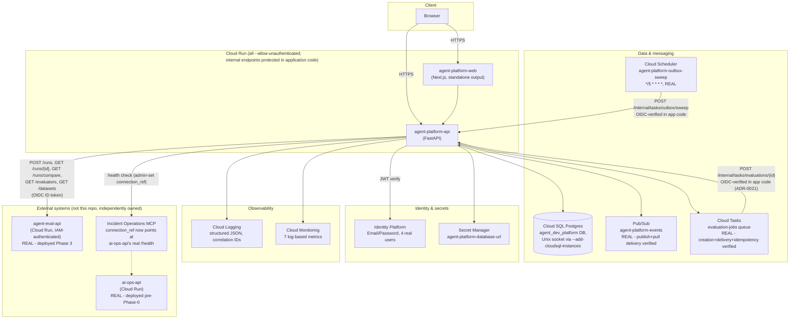

# GCP Architecture

Every service below has a stated reason to exist, tied to a specific requirement elsewhere in these docs - none are included for coverage. Where a real, inspected system already uses a pattern (Cloud Run + Cloud SQL in `ai-operations`), this platform reuses it rather than inventing an alternative.

**Status: fully deployed (Phase 6).** Every service in the table below is real and live in `ai-ops-center-eb26`, not planned or partially wired. See `docs/phase-notes/phase-6.md` for the full deployment record, live-verification transcript, and bugs found along the way.

## Services and why each exists

| Service | Reason | Status |
|---|---|---|
| **Cloud Run** (frontend + API) | Matches `ai-operations`' proven, live deployment pattern (`gcloud run deploy`). Stateless FastAPI/Next.js services, no reason to run anything heavier. | Deployed: `agent-platform-api`, `agent-platform-web` |
| **Cloud SQL (PostgreSQL)** | Control-plane data of record - agents, versions, manifests, grants, policies, promotions, audit. Relational integrity (foreign keys, the `UNIQUE (agent_id) WHERE stage='production'` partial index on `AgentVersionLifecycle`, transactional audit writes) is load-bearing here, not incidental - see [`failure-modes.md`](failure-modes.md) and [`audit-model.md`](audit-model.md). | Deployed: `agent_dev_platform` database on the existing shared `ai-ops-db` instance (ADR-0017); all 16 migrations applied to a fresh copy of that database this phase, confirmed reproducible |
| **Identity Platform / Firebase Auth** | This platform is the first of the four systems to need real authentication - see [`auth-and-approval-model.md`](auth-and-approval-model.md). Issues the JWT the API verifies on every request. | Deployed: Email/Password provider enabled, 4 real seeded users, `verify_id_token` (unmodified since Phase 1) verified against real tokens |
| **Pub/Sub** | Fan-out of domain/lifecycle events, decoupled from the request path - a real transactional outbox (`OutboxEvent`) after transactional Postgres writes. See [`audit-model.md`](audit-model.md), [ADR-0020](adrs/0020-promotion-lifecycle-event-outbox.md). Not used for anything synchronous. | Deployed and durable: `agent-platform-events` topic; publish-then-pull delivery live-verified; the sweep/retry half of the outbox (`sweep_unpublished_outbox_events`) is real and now runs on a Cloud Scheduler cadence, not just "possible in theory" |
| **Cloud Tasks** | The one place this platform genuinely needs durable, retryable, long-running background execution: invoking `agent-eval`'s synchronous, multi-minute `POST /runs` without blocking an API request. See [`evaluation-and-promotion.md`](evaluation-and-promotion.md). | Deployed and closed end-to-end: queue `evaluation-jobs` creates tasks, the real deployed API receives and processes them (`POST /internal/tasks/evaluations/{id}`), OIDC push auth verified in application code (ADR-0021), duplicate delivery and failed-task behavior live-verified |
| **Cloud Scheduler** | Recurring, not event-triggered, work. Used this phase for the outbox reconciliation sweep (`agent-platform-outbox-sweep`, every 5 minutes). | Deployed for the outbox sweep. **Not** wired for periodic MCP health checks (see "Known gap" below) - `POST /v1/mcp-servers/{id}/health-check` remains a manually/on-demand-triggered real HTTP check, not yet on a schedule. |
| **Secret Manager** | `DATABASE_URL`, service credentials for calling `agent-eval`/`ai-operations`. Same role it already plays in `ai-operations`. | Deployed: `agent-platform-database-url` holds the full runtime `DATABASE_URL` (including the `agent_platform_app` password), mounted via `--set-secrets`, not an inlined plaintext env var (see "Bugs found" in phase-6 notes for why this needed a follow-up fix) |
| **Cloud Logging / Monitoring** | Structured JSON logs (`app/observability.py`) correlating every async hop by `evaluation_run_reference_id` / `agent_version_id` / `promotion_request_id` / Cloud Task name; 7 log-based metrics for the signals the brief named (evaluation success/failure, agent-eval latency, promotion rejections, stale-evidence blocks, outbox publish failures, Cloud Tasks retries). | Deployed |
| **Cloud Trace** | Considered, deliberately not added - see "Observability" in `docs/phase-notes/phase-6.md` for the reasoning (correlation-ID structured logging already answers the debugging need for this system's actual async flows; adding Trace would mean instrumenting `agent-eval-api` and `ai-ops-api`, both independently owned, for a marginal gain). | Not added, by decision |

## agent-eval's real Cloud Run deployment (Phase 3)

Deployed per [ADR-0016](adrs/0016-agent-eval-deployment-decision.md) and [ADR-0017](adrs/0017-shared-cloud-sql-instance-isolated-database.md) - full detail and live verification evidence in [`phase-notes/phase-3.md`](phase-notes/phase-3.md). Summary:

| Aspect | Value |
|---|---|
| Service name | `agent-eval-api` |
| Region | `us-central1` (matches `ai-operations`' existing services) |
| Image | `us-central1-docker.pkg.dev/ai-ops-center-eb26/ai-ops-images/agent-eval-api:v1` (built via Cloud Build, no local Docker daemon required) |
| Database | `agent_eval` database + `agent_eval_app` user, on the **existing** `ai-ops-db` Cloud SQL instance - not a new instance (ADR-0017) |
| DB connectivity | Cloud Run's native Cloud SQL connector (`--add-cloudsql-instances`), `DATABASE_URL` via Secret Manager (`agent-eval-db-url`) - identical pattern to `ai-ops-api`'s own deployment |
| Auth | `--no-allow-unauthenticated` (Cloud Run IAM) - **zero application-code changes** to `agent-eval` itself; a dedicated service account, `agent-dev-platform-caller@ai-ops-center-eb26.iam.gserviceaccount.com`, holds `roles/run.invoker` on this service |
| Changes to `agent-eval`'s own repo | One new file: `backend/Dockerfile`. Nothing else. |

### Service-to-service authentication

`HttpAgentEvalClient` (`app/integrations/agent_eval_client.py`) sends a real Google-signed ID token when `settings.agent_eval_audience` is set (the deployed Cloud Run URL), and no `Authorization` header at all against an unauthenticated local instance - matching each target's actual reality rather than always sending a token nothing checks. Two token-minting paths, chosen automatically:

- **Production (Phase 6, real)**: `agent-platform-api`'s own attached service account (Application Default Credentials, resolved via the Cloud Run metadata server - no impersonation setting, no key file) calls `agent-eval-api` directly. This required one IAM grant: `roles/run.invoker` on `agent-eval-api` for `agent-platform-api@ai-ops-center-eb26.iam.gserviceaccount.com`.
- **Local development / manual live verification**: a human's `gcloud` login is not itself a service account and cannot mint an audience-scoped ID token directly (`fetch_id_token` rejects it - "Invalid account type", confirmed live). Instead, `google.auth.impersonated_credentials` mints a short-lived token by impersonating `agent-dev-platform-caller` - the developer's own `gcloud` session needs `roles/iam.serviceAccountTokenCreator` on that service account (granted once, temporarily, for verification). **No service-account key file was ever downloaded or persisted** for either path - deliberately, to avoid a long-lived exportable credential.

### Cost footprint

Cloud Run scales to zero and bills per request; the shared Cloud SQL instance was already running and already being paid for regardless of any of this platform's deployments (ADR-0017); Artifact Registry added a handful of images (~100-200 MB each) to the existing shared `ai-ops-images` repo. No new Cloud SQL instance, no always-on compute, no material new spend from this phase's work beyond the request volume of live verification itself (a few dozen real API calls, three real evaluation runs).

## Explicitly not used

- **Cloud Storage** - manifests are small, structured JSONB that belongs in Postgres transactionally; see [ADR-0003](adrs/0003-manifest-representation-and-storage.md). No large binary artifacts exist in this system's domain to justify object storage.
- **Vertex AI / any LLM provider** - this platform makes no model calls itself. See [ADR-0013](adrs/0013-no-first-party-model-usage.md).
- **Kubernetes** - explicit non-goal; Cloud Run covers the actual scaling/traffic needs of a stateless CRUD+orchestration control plane.
- **VPC connector** - an earlier draft of this document (through Phase 5) assumed `ai-operations`' real deployment used one for its Cloud SQL connection. Direct inspection of the live `ai-ops-api` Cloud Run service this phase found that assumption wrong: it uses the same `--add-cloudsql-instances` Unix-socket connector this platform uses, with no VPC network configuration at all. See the Phase 6 update on [ADR-0012](adrs/0012-gcp-deployment-topology.md).

## Pub/Sub vs. Cloud Tasks vs. Cloud Scheduler - kept genuinely separate

These are easy to conflate and the brief specifically calls out not to. The distinguishing question this design uses: **is this "notify anyone interested that X happened" (Pub/Sub), "this one specific operation must durably complete, possibly after retries, independent of the request that triggered it" (Cloud Tasks), or "run this on a clock, not in response to any one event" (Cloud Scheduler)?**

- Pub/Sub: `agent_version.promoted` today (still scoped to that one event type, per ADR-0020 - the full audit-event catalog is not fanned out) - fan-out, at-least-once, no expectation any particular consumer exists yet. No real subscriber *service* exists downstream of the topic; the outbox durably retries publish, but nothing currently consumes what's published.
- Cloud Tasks: "run this evaluation via `agent-eval`'s blocking API and write the result back" - a single owned operation with a single owned outcome, needing retry/backoff semantics, not a broadcast.
- Cloud Scheduler: the outbox reconciliation sweep - recurring on a clock, not triggered by a domain event.

See [ADR-0011](adrs/0011-pubsub-vs-cloud-tasks.md), [ADR-0020](adrs/0020-promotion-lifecycle-event-outbox.md), [ADR-0021](adrs/0021-cloud-tasks-application-level-push-auth.md).

## Diagram: deployment topology (as actually deployed, Phase 6)

`agent-eval-api` and `ai-ops-api` are drawn inside "External systems" deliberately - both are real, independently deployed and owned Cloud Run services this platform calls over the network, never services this platform deploys or manages ([ADR-0016](adrs/0016-agent-eval-deployment-decision.md)). Every edge in this diagram is now real and live-verified; the Phase 5 diagram's dotted "not yet deployed" edges are gone.
