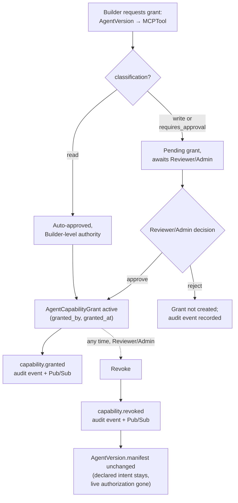

# MCP Governance

## Registry

`MCPServer`: `name, environment, owner_team_id, connection_ref, health_status, last_health_check_at`. Modeled on the one real MCP server in the organization, `ai-operations/mcp_server` (registered name: `trace-incidents`), which is itself a thin `httpx` wrapper over the Incident Investigation Platform's FastAPI backend, configured via a `BACKEND_URL` env var and spawned over stdio per its `.mcp.json`. `connection_ref` stores that same kind of pointer — the platform never holds a live MCP client connection; health is checked out-of-band (see below), and tool execution is always initiated by the agent runtime, never by this platform.

`MCPTool`: `mcp_server_id, name, description, io_schema, classification (read|write), requires_approval`. Seeded directly from the four real tools inspected in `ai-operations/mcp_server/server.py`:

| Tool | Classification | Requires approval | Notes |
|---|---|---|---|
| `get_investigation_status` | read | false | Wraps `GET /v1/investigations/{id}/status` |
| `search_documents` | read | false | Wraps `POST /v1/knowledge/search` |
| `get_incident_history` | read | false | Wraps `GET /v1/investigations` |
| `create_ticket` | write | **true** | Wraps `POST /v1/tickets`; the MCP tool has a real code-level confirm gate, but two documented bypass paths exist — see below |

## The distinction that matters: authorization vs. approval

These are two different questions and this platform answers only one of them.

- **Authorization** (this platform's job): *is this `AgentVersion` allowed to call this tool at all?* Answered by the presence of a non-revoked `AgentCapabilityGrant`.
- **Approval** (the execution plane's job): *for this specific invocation, right now, does a human need to say yes before it executes?* Answered by whatever runtime mechanism the agent's own system implements — in `ai-operations`, the `l3_approval_gate` node and `interrupt()`/`Command()` LangGraph pattern.

A `Builder` being authorized to configure `create_ticket` for an `AgentVersion` does **not** mean the running agent may execute that write without a human approving the specific call. `MCPTool.requires_approval = true` is this platform's record of *what should happen* at call time; it is a declaration, not an enforcement mechanism, because this platform does not sit in the execution path (see [`control-plane-boundaries.md`](control-plane-boundaries.md)).

This distinction is not theoretical here, and the exact enforcement boundary is worth stating precisely rather than generalizing it as "not server-enforced" — that phrase undersells the one part of it that *is* real code, and oversells the parts that aren't. Direct inspection of `ai-operations/mcp_server/server.py`, `ai-operations/backend/app/api/v1/tickets.py`, `ai-operations/backend/app/shared/schemas/ticket.py`, and the system's own `docs/decisions/ADR-013-mcp-server-integration.md` found three distinct layers:

1. **The MCP tool function has a genuine code-level gate.** `create_ticket(..., confirm: bool = False)` contains a real `if not confirm: return preview` branch — when `confirm` is false, **no HTTP call is made to the backend at all**. This is actual enforcement, not just a docstring suggestion, and `ai-operations`' own ADR-013 confirms it was verified live (`confirm=False` → zero backend calls; `confirm=True` → a real `POST /v1/tickets`).
2. **What that gate does *not* do: verify that a human actually approved anything.** `confirm` is a plain boolean parameter fully controlled by the calling client. The MCP server holds no session state proving a preview was actually shown or that a human actually agreed — it only checks the value it's handed. Nothing in code stops a client from passing `confirm=True` on the very first call; the only thing discouraging that is the tool's docstring instructing the calling model "Never call with confirm=True on the first attempt." **This one specific decision — is this confirm=True justified — is genuinely prompt-convention**, resting entirely on the calling model's compliance.
3. **The backend `POST /v1/tickets` endpoint has no confirmation concept whatsoever.** Its `TicketCreate` schema (`app/shared/schemas/ticket.py`) has no `confirm` field at all — and `model_config = ConfigDict(extra="forbid")` means one couldn't even be smuggled through by accident — it validates only that `investigation_id` exists and inserts unconditionally. **Any caller that reaches this endpoint directly, bypassing the MCP tool layer entirely, creates a ticket with no gate of any kind.** This is a second, complete bypass path, independent of the first.

`ai-operations`' own ADR-013 reaches the same conclusion about its own system, in its Consequences section: "`create_ticket`'s confirmation is enforced by prompt/convention (the tool's docstring), not by the server refusing an unconfirmed write outright — a misbehaving or adversarial client could still pass `confirm=True` on the first call. Acceptable for a demo/portfolio tool; would need a server-side gate ... for a production write surface."

This platform's design treats both bypass paths as real, current gaps in a system it governs — not something to paper over by assuming `requires_approval = true` means anything is actually enforced end-to-end. The honest scope of `MCPTool.requires_approval` is: *the platform will not authorize a grant of this tool without Reviewer/Admin sign-off, and will visibly flag in the UI that this tool requires runtime approval* — full stop. Whether the runtime actually enforces that at the moment of the call — and, per the analysis above, whether that enforcement can be sidestepped at the tool layer (bypass 2) or skipped entirely by calling the underlying API directly (bypass 3) — is that runtime's responsibility, and today, for `ai-operations`, both are known, documented weak points, not a hypothetical concern.

## Capability grants

`AgentCapabilityGrant(agent_version_id, mcp_tool_id, granted_by, granted_at, revoked_by?, revoked_at?)` — mutable and revocable, deliberately separate from the immutable manifest (see [`agent-manifest.md`](agent-manifest.md) and [ADR-0004](adrs/0004-mcp-capability-grant-model.md)).

Granting authority scales with risk:

- **Read-capable tools**: any `Builder` on the agent's owning team may grant.
- **Write-capable and/or approval-required tools**: only `Reviewer` or `Admin` may grant. A `Builder` can request one (creating the grant in a way that still requires Reviewer/Admin sign-off before it's active — see [`auth-and-approval-model.md`](auth-and-approval-model.md)).

Revocation is available to `Reviewer`/`Admin` at any time, independent of the `AgentVersion`'s lifecycle stage — including after it's in production. This is the mechanism behind the "capability revoked after an `AgentVersion` was created" failure mode in [`failure-modes.md`](failure-modes.md).

## Health

`MCPServer.health_status` is refreshed by a periodic Cloud Scheduler-triggered job (see [`gcp-architecture.md`](gcp-architecture.md)), never checked synchronously during a grant or promotion request. An unhealthy server does **not** block new grants or promotions by default — health is availability, not authorization, and the two are kept separate. Admins can still see and act on health in the UI. This is a deliberate MVP simplification, revisited in [`open-questions.md`](open-questions.md).

## Diagram: governance flow

