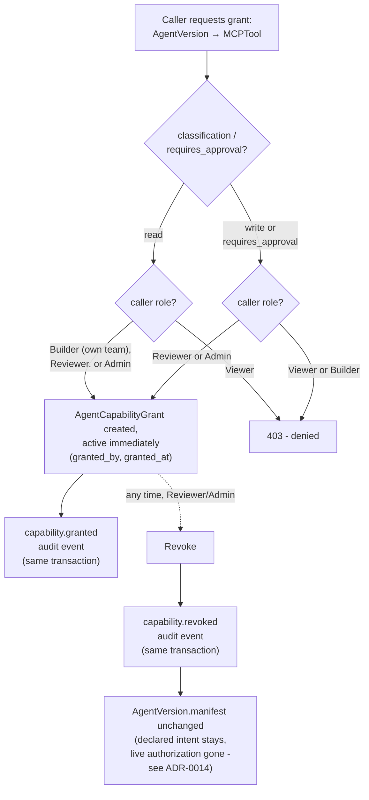

# MCP Governance

## Registry

`MCPServer`: `name, environment, owner_team_id, connection_ref, health_status, last_health_check_at`. Modeled on the one real MCP server in the organization, `ai-operations/mcp_server` (the FastMCP process itself identifies as `trace-incidents`; this platform registers it under the name `incident-operations`, matching the `mcp.servers[]` reference used throughout `docs/agent-manifest.md`'s example manifest), which is itself a thin `httpx` wrapper over the Incident Investigation Platform's FastAPI backend, configured via a `BACKEND_URL` env var and spawned over stdio per its `.mcp.json`. `connection_ref` stores a pointer to that backing FastAPI service (e.g. `http://127.0.0.1:8080` in local dev) - the platform never holds a live MCP client connection to the stdio server itself; health is checked out-of-band against the backend it wraps (see below), and tool execution is always initiated by the agent runtime, never by this platform.

`MCPTool`: `mcp_server_id, name, description, io_schema, classification (read|write), requires_approval`. Seeded directly from the four real tools inspected in `ai-operations/mcp_server/server.py`:

| Tool | Classification | Requires approval | Notes |
|---|---|---|---|
| `get_investigation_status` | read | false | Wraps `GET /v1/investigations/{id}/status` |
| `search_documents` | read | false | Wraps `POST /v1/knowledge/search` |
| `get_incident_history` | read | false | Wraps `GET /v1/investigations` |
| `create_ticket` | write | **true** | Wraps `POST /v1/tickets`; the MCP tool has a real code-level confirm gate, but two documented bypass paths exist - see below |

## The distinction that matters: authorization vs. approval

These are two different questions and this platform answers only one of them.

- **Authorization** (this platform's job): *is this `AgentVersion` allowed to call this tool at all?* Answered by the presence of a non-revoked `AgentCapabilityGrant`.
- **Approval** (the execution plane's job): *for this specific invocation, right now, does a human need to say yes before it executes?* Answered by whatever runtime mechanism the agent's own system implements - in `ai-operations`, the `l3_approval_gate` node and `interrupt()`/`Command()` LangGraph pattern.

A `Builder` being authorized to configure `create_ticket` for an `AgentVersion` does **not** mean the running agent may execute that write without a human approving the specific call. `MCPTool.requires_approval = true` is this platform's record of *what should happen* at call time; it is a declaration, not an enforcement mechanism, because this platform does not sit in the execution path (see [`control-plane-boundaries.md`](control-plane-boundaries.md)).

This distinction is not theoretical here, and the exact enforcement boundary is worth stating precisely rather than generalizing it as "not server-enforced" - that phrase undersells the one part of it that *is* real code, and oversells the parts that aren't. Direct inspection of `ai-operations/mcp_server/server.py`, `ai-operations/backend/app/api/v1/tickets.py`, `ai-operations/backend/app/shared/schemas/ticket.py`, and the system's own `docs/decisions/ADR-013-mcp-server-integration.md` found three distinct layers:

1. **The MCP tool function has a genuine code-level gate.** `create_ticket(..., confirm: bool = False)` contains a real `if not confirm: return preview` branch - when `confirm` is false, **no HTTP call is made to the backend at all**. This is actual enforcement, not just a docstring suggestion, and `ai-operations`' own ADR-013 confirms it was verified live (`confirm=False` → zero backend calls; `confirm=True` → a real `POST /v1/tickets`).
2. **What that gate does *not* do: verify that a human actually approved anything.** `confirm` is a plain boolean parameter fully controlled by the calling client. The MCP server holds no session state proving a preview was actually shown or that a human actually agreed - it only checks the value it's handed. Nothing in code stops a client from passing `confirm=True` on the very first call; the only thing discouraging that is the tool's docstring instructing the calling model "Never call with confirm=True on the first attempt." **This one specific decision - is this confirm=True justified - is genuinely prompt-convention**, resting entirely on the calling model's compliance.
3. **The backend `POST /v1/tickets` endpoint has no confirmation concept whatsoever.** Its `TicketCreate` schema (`app/shared/schemas/ticket.py`) has no `confirm` field at all - and `model_config = ConfigDict(extra="forbid")` means one couldn't even be smuggled through by accident - it validates only that `investigation_id` exists and inserts unconditionally. **Any caller that reaches this endpoint directly, bypassing the MCP tool layer entirely, creates a ticket with no gate of any kind.** This is a second, complete bypass path, independent of the first.

`ai-operations`' own ADR-013 reaches the same conclusion about its own system, in its Consequences section: "`create_ticket`'s confirmation is enforced by prompt/convention (the tool's docstring), not by the server refusing an unconfirmed write outright - a misbehaving or adversarial client could still pass `confirm=True` on the first call. Acceptable for a demo/portfolio tool; would need a server-side gate ... for a production write surface."

This platform's design treats both bypass paths as real, current gaps in a system it governs - not something to paper over by assuming `requires_approval = true` means anything is actually enforced end-to-end. The honest scope of `MCPTool.requires_approval` is: *the platform will not authorize a grant of this tool without Reviewer/Admin sign-off, and will visibly flag in the UI that this tool requires runtime approval* - full stop. Whether the runtime actually enforces that at the moment of the call - and, per the analysis above, whether that enforcement can be sidestepped at the tool layer (bypass 2) or skipped entirely by calling the underlying API directly (bypass 3) - is that runtime's responsibility, and today, for `ai-operations`, both are known, documented weak points, not a hypothetical concern.

## Capability grants

`AgentCapabilityGrant(agent_version_id, mcp_tool_id, granted_by, granted_at, revoked_by?, revoked_at?)` - mutable and revocable, deliberately separate from the immutable manifest (see [`agent-manifest.md`](agent-manifest.md) and [ADR-0004](adrs/0004-mcp-capability-grant-model.md)).

Granting authority scales with risk:

- **Read-capable tools**: any `Builder` on the agent's owning team may grant - the grant is created active immediately, in one call.
- **Write-capable and/or approval-required tools**: only `Reviewer` or `Admin` may grant, also in one call.

**Correction made during Phase 2 implementation:** Phase 0's version of this doc described a Builder-requests/Reviewer-approves two-step flow for write-capable grants, mirroring `PromotionRequest`/`PromotionDecision`. Building the real endpoint (`POST /v1/agent-versions/{id}/capability-grants`) surfaced that this was never actually load-bearing: nothing in the domain model names a `CapabilityGrantRequest` entity, and the live verification flow this phase was built to prove ("authorized admin/reviewer → grant ... capabilities") describes a direct grant by an already-authorized actor, not a request awaiting someone else's approval. The simpler model is what's implemented: a `Builder` attempting to grant a write-capable or approval-required tool receives an immediate `403`, full stop - there is no pending, half-created grant state to approve into being. A two-step request/approval flow for capability grants remains a legitimate future addition if a real need for it appears (e.g. "Builders should be able to flag a desired write capability for review without needing a Reviewer to do the actual API call"), but it should be built as a deliberate, separately-justified addition, not implied by leftover wording from before the endpoint existed. See [`auth-and-approval-model.md`](auth-and-approval-model.md) for the authoritative permission matrix.

Revocation is available to `Reviewer`/`Admin` at any time, independent of the `AgentVersion`'s lifecycle stage - including after it's in production. This is the mechanism behind the "capability revoked after an `AgentVersion` was created" failure mode in [`failure-modes.md`](failure-modes.md). Revoking never edits or removes the original grant row - it sets `revoked_by`/`revoked_at` on it, so it stays visible in `?include_revoked=true` history. Re-granting the same `(AgentVersion, MCPTool)` pair after a revocation creates a *new* grant row; the old one remains, permanently, as revoked history. See [ADR-0014](adrs/0014-capability-grant-reproducibility.md) for the exact reproducibility tradeoff this creates and why it's accepted rather than "solved" by making grants immutable too.

## Health

`MCPServer.health_status` is refreshed by a real HTTP call - `POST /v1/mcp-servers/{id}/health-check` calls `GET {connection_ref}/health` (`app/services/mcp.py::check_server_health`) and records `healthy` (200 response), `degraded` (any other response), or `unavailable` (connection error/timeout). In Phase 2 this is triggered on demand by any authenticated user (open to Viewer+, since health is availability, not authorization - the same reasoning as the "not blocking new grants" rule below); a periodic Cloud Scheduler-triggered version of the same call is still the intended production cadence (`docs/gcp-architecture.md`) but wasn't needed to prove the health-check mechanism works, and wasn't built this phase. Live-verified against the real `ai-operations` backend during Phase 2 (`docs/phase-notes/phase-2.md`) - a genuine `GET http://127.0.0.1:8080/health` call, not a simulated status flip.

An unhealthy server does **not** block new grants or promotions by default - health is availability, not authorization, and the two are kept separate. Admins can still see and act on health via the registry. This is a deliberate MVP simplification, revisited in [`open-questions.md`](open-questions.md).

## Real MCP integration: registration is explicit, not discovered

`ai-operations/mcp_server` runs over stdio, spawned per MCP client (per its `.mcp.json`), and exposes no HTTP introspection endpoint - confirmed again during Phase 2 by checking the live `ai-operations` backend's own OpenAPI schema (`GET /openapi.json`), which lists no route for listing MCP tools or schemas. There is nothing this control plane can poll to "discover" what tools exist. Building a discovery mechanism would mean adding an MCP client dependency and spawning/talking to the stdio subprocess directly from this platform - a real option, but disproportionate to what Phase 2 needed to prove (that the registry model itself is sound), and arguably a step toward this platform acting as an MCP client, which sits closer to the execution plane than a pure control plane should (`docs/control-plane-boundaries.md`).

Instead, the four real tools are registered explicitly - read directly out of `ai-operations/mcp_server/server.py`'s tool signatures and docstrings by a human (or an agent doing the same reading a human would), via `scripts/seed_orion_commerce.py` calling the same `POST /v1/mcp-servers/{id}/tools` endpoint any Admin would use. Nothing here is invented: the tool names, classifications, and `requires_approval` values match the table above exactly, re-verified against the live source during Phase 2 (unchanged since Phase 0's original inspection - confirmed via `git log` on the relevant files).

## Diagram: governance flow

No intermediate "pending" state exists - a grant call either succeeds immediately (already-active row) or is rejected outright (`403`), matching what's actually implemented (`app/services/capability_grants.py`).
