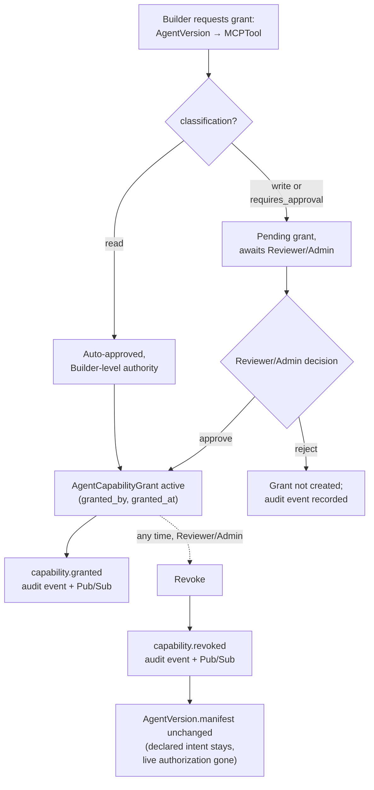

# MCP Governance

## Registry

`MCPServer`: `name, environment, owner_team_id, connection_ref, health_status, last_health_check_at`. Modeled on the one real MCP server in the organization, `ai-operations/mcp_server` (registered name: `trace-incidents`), which is itself a thin `httpx` wrapper over the Incident Investigation Platform's FastAPI backend, configured via a `BACKEND_URL` env var and spawned over stdio per its `.mcp.json`. `connection_ref` stores that same kind of pointer — the platform never holds a live MCP client connection; health is checked out-of-band (see below), and tool execution is always initiated by the agent runtime, never by this platform.

`MCPTool`: `mcp_server_id, name, description, io_schema, classification (read|write), requires_approval`. Seeded directly from the four real tools inspected in `ai-operations/mcp_server/server.py`:

| Tool | Classification | Requires approval | Notes |
|---|---|---|---|
| `get_investigation_status` | read | false | Wraps `GET /v1/investigations/{id}/status` |
| `search_documents` | read | false | Wraps `POST /v1/knowledge/search` |
| `get_incident_history` | read | false | Wraps `GET /v1/investigations` |
| `create_ticket` | write | **true** | Wraps `POST /v1/tickets`; confirm-gated in the tool's own logic, **not server-enforced** — see below |

## The distinction that matters: authorization vs. approval

These are two different questions and this platform answers only one of them.

- **Authorization** (this platform's job): *is this `AgentVersion` allowed to call this tool at all?* Answered by the presence of a non-revoked `AgentCapabilityGrant`.
- **Approval** (the execution plane's job): *for this specific invocation, right now, does a human need to say yes before it executes?* Answered by whatever runtime mechanism the agent's own system implements — in `ai-operations`, the `l3_approval_gate` node and `interrupt()`/`Command()` LangGraph pattern.

A `Builder` being authorized to configure `create_ticket` for an `AgentVersion` does **not** mean the running agent may execute that write without a human approving the specific call. `MCPTool.requires_approval = true` is this platform's record of *what should happen* at call time; it is a declaration, not an enforcement mechanism, because this platform does not sit in the execution path (see [`control-plane-boundaries.md`](control-plane-boundaries.md)).

This distinction is not theoretical here. Inspection of `ai-operations/mcp_server/server.py` found that `create_ticket`'s `confirm` gate is enforced only by the tool's Python docstring instructing the calling LLM to set `confirm=True` — a well-behaved model follows it, a first call can still pass `confirm=True` directly, and nothing on the server rejects that. The system's own ADR-013 acknowledges this is acceptable only for a demo/portfolio tool. This platform's design treats that as a real, current gap in the systems it governs — not something to paper over by assuming `requires_approval = true` means anything is actually enforced. The honest scope of `MCPTool.requires_approval` is: *the platform will not authorize a grant of this tool without Reviewer/Admin sign-off, and will visibly flag in the UI that this tool requires runtime approval* — full stop. Whether the runtime actually honors that at the moment of the call is that runtime's responsibility, and today, for `ai-operations`, it's a known weak point.

## Capability grants

`AgentCapabilityGrant(agent_version_id, mcp_tool_id, granted_by, granted_at, revoked_by?, revoked_at?)` — mutable and revocable, deliberately separate from the immutable manifest (see [`agent-manifest.md`](agent-manifest.md) and [ADR-0004](adrs/0004-mcp-capability-grant-model.md)).

Granting authority scales with risk:

- **Read-capable tools**: any `Builder` on the agent's owning team may grant.
- **Write-capable and/or approval-required tools**: only `Reviewer` or `Admin` may grant. A `Builder` can request one (creating the grant in a way that still requires Reviewer/Admin sign-off before it's active — see [`auth-and-approval-model.md`](auth-and-approval-model.md)).

Revocation is available to `Reviewer`/`Admin` at any time, independent of the `AgentVersion`'s lifecycle stage — including after it's in production. This is the mechanism behind the "capability revoked after an `AgentVersion` was created" failure mode in [`failure-modes.md`](failure-modes.md).

## Health

`MCPServer.health_status` is refreshed by a periodic Cloud Scheduler-triggered job (see [`gcp-architecture.md`](gcp-architecture.md)), never checked synchronously during a grant or promotion request. An unhealthy server does **not** block new grants or promotions by default — health is availability, not authorization, and the two are kept separate. Admins can still see and act on health in the UI. This is a deliberate MVP simplification, revisited in [`open-questions.md`](open-questions.md).

## Diagram: governance flow

