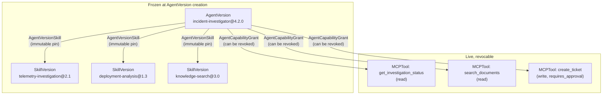

# Skills and Capabilities

## Skill → SkillVersion → attached to AgentVersion

A `Skill` is a reusable capability identity (e.g. `telemetry-investigation`), owned by a team. A `SkillVersion` (e.g. `telemetry-investigation@2.1`) is one immutable, published definition of that capability, with enough metadata to understand it without reading its implementation:

- `name`, `version`, `owner` (a `User`)
- `purpose` - a short description of what it does
- `input_contract` / `output_contract` - enough to understand the interface, not a full schema registry
- `implementation_ref` - a pointer to the code/config that implements it (e.g. a git ref into the owning agent's repo, such as `ai-operations/backend/app/graph/nodes/telemetry.py`)
- `compatible_frameworks[]` - e.g. `["langgraph"]`, so an `AgentVersion` creation can reject an incompatible pin

`SkillVersion` publication is a one-way action (`skill_version.published` audit event) - there is no edit endpoint, only "publish a new version."

## Agents pin exact SkillVersions

`AgentVersionSkill(agent_version_id, skill_version_id)` is written once, at `AgentVersion` creation, and never modified afterward - it's part of what makes the version's manifest reproducible (see [`agent-versioning.md`](agent-versioning.md)). An agent does **not** dynamically resolve "whatever `telemetry-investigation` currently points to" at runtime; it resolves to the exact version pinned when it was built. This mirrors `agent-eval`'s own evaluator-versioning discipline (`Evaluator` rows are unique on `(key, version)`, never edited in place) - the same pattern, applied to skills.

## Attachment timing: no draft composition phase

Phase 2 implementation had to settle a question Phase 0/1 left implicit: does skill attachment happen only at `AgentVersion` creation, or is there a separate "draft composition" phase where a builder iteratively adds skills to an in-progress, still-mutable version before finalizing it?

**Decision: attachment happens exactly once, atomically with `AgentVersion` creation itself - there is no draft composition phase, and no code path was built that could add one later without contradicting ADR-0002.** `POST /v1/agents/{agent_id}/versions` accepts the complete manifest (including `skills[]`) in one request; the `AgentVersion` row, its `AgentVersionSkill` pins, and its initial `AgentVersionLifecycle(stage=draft)` row are all written in the same database transaction (`app/services/agents.py::create_agent_version`). This isn't a new decision so much as the existing one taken literally: ADR-0002 already says `AgentVersion` is immutable with zero exceptions, and "attach skills after creation, before some later finalization step" would require exactly the kind of mutation window ADR-0002 rules out.

This does mean `stage=draft` describes the version's *lifecycle position* (not yet evaluated or promoted), never its *content maturity* - a `draft` version's manifest is exactly as finalized and immutable as a `production` one; the only thing that changes between the two is which row exists in `AgentVersionLifecycle`. A builder who wants to iterate on a manifest before "really" committing to it does so client-side (in the UI or their own tooling, Phase 5 scope) and only calls the creation endpoint once satisfied - the same discipline `git commit` imposes versus an editable scratch buffer. This is a real, deliberate cost of the immutability guarantee, not a gap: revisit only if Phase 6's live usage shows builders routinely burning through many draft `AgentVersion`s for a single intended change, which would be an argument for better client-side manifest tooling, not for a server-side mutable draft state.

## Where skills come from today

`ai-operations` doesn't have a `Skill`/`SkillVersion` concept at all - its specialist behavior (telemetry, deployment, knowledge investigation) is implemented as LangGraph nodes with hardcoded logic, not registered capabilities. Modeling the Incident Investigator's three specialists as seeded `SkillVersion`s (`telemetry-investigation@2.1`, `deployment-analysis@1.3`, `knowledge-search@3.0`) is this platform introducing the concept, not reflecting something that already existed - flagged here so it isn't mistaken for an existing integration the way the MCP tools are.

**Phase 9 update**: the real CI pipeline now asserts this composition as part of what it publishes, not just something a human typed in once. `ai-operations`' `publish-to-orion.yml` manifest declares `skills: ["telemetry-investigation@2.1", "deployment-analysis@1.3", "knowledge-search@3.0"]` - the same three real LangGraph nodes (`backend/app/graph/nodes/{telemetry,deployment,knowledge}.py`) the manifest names, resolved and pinned the same way any other `AgentVersion`'s skills are. `Skill`/`SkillVersion` still doesn't exist as a concept inside `ai-operations` itself - Orion is still the only place recording it - but it's no longer purely representative data either: a real, CI-verified commit now really does claim to use exactly these three skills.

## Skill review: a version's own "recommended" concept (Phase 9)

Through Phase 8, a `SkillVersion` had no lifecycle at all beyond "exists" - no way to ask "which version should I actually use," no review step, nothing. `SkillVersionLifecycle` (`published → recommended → deprecated`) and `SkillReviewRequest`/`SkillReviewDecision` close that gap, mirroring `AgentVersionLifecycle`/`PromotionRequest`/`PromotionDecision`'s proven shape - same no-self-approval DB trigger, same "one RECOMMENDED row per parent" partial unique index, same fully-immutable-decision guarantee - **without reusing those tables**. See [ADR-0025](adrs/0025-skill-review-as-a-separate-model.md) for why: `PromotionRequest` has hard, `NOT NULL` foreign keys into the AgentVersion evaluation-gate machinery (`evaluation_run_reference_id`, `evaluation_policy_id`) that a `SkillVersion` - which has no automated evaluator, no `agent-eval` integration, no gates at all - simply cannot honestly satisfy.

A `SkillVersion` is `published` the instant it's created (unchanged - `create_skill_version` always starts here). Becoming `recommended` requires an independent Reviewer/Admin to approve a `SkillReviewRequest` filed by a Builder (own team) or above - the same permission shape as an Agent promotion, via `app/services/skill_reviews.py`. A Builder publishing their own skill version can never make it "the recommended one" by themselves.

## Dependency and impact analysis (Phase 9)

No new tables - `app/services/skills.py::get_skill_impact` is a pure read aggregation over `SkillVersion`, `AgentVersionSkill`, `AgentVersion`, `AgentVersionLifecycle`, and `Agent`, all of which already existed. Two deliberately separate views (`GET /v1/skills/{id}/impact`):

- **`current_impact`**: each Agent's single most recent, non-`deprecated` `AgentVersion` that still pins an older `SkillVersion` than the latest one published for this skill - one row per Agent, answering "who's affected right now."
- **`historical_consumers`**: every `AgentVersion` that has ever pinned an older version, unfiltered - the full record, kept in a separate section (`docs/phase-notes/phase-9.md`'s "All consumers / history") so it never drowns out the current, actionable view.

Publishing a new `SkillVersion` never touches an existing, immutable `AgentVersion`'s pin - "who's affected" is visibility, not automatic migration. Adopting a newer skill version always means publishing a new `AgentVersion`.

## Diagram: version-skill-capability relationship

The two halves of this diagram have different mutability rules on purpose: skill pins are part of what a version *is* and can never change; capability grants are part of what a version is *currently allowed to do* and can change out from under it. See [`mcp-governance.md`](mcp-governance.md) and [ADR-0004](adrs/0004-mcp-capability-grant-model.md).

## Compatibility checks

At `AgentVersion` creation, each pinned `SkillVersion.compatible_frameworks[]` must include the manifest's `agent.framework`. This is a cheap, static check - not a runtime guarantee that the skill actually works, which remains the owning team's responsibility (this platform doesn't execute anything, per [`control-plane-boundaries.md`](control-plane-boundaries.md)).
